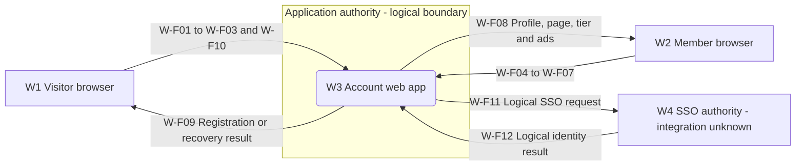
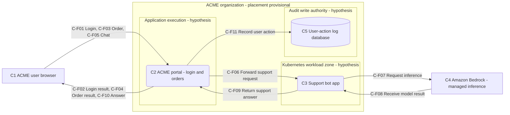
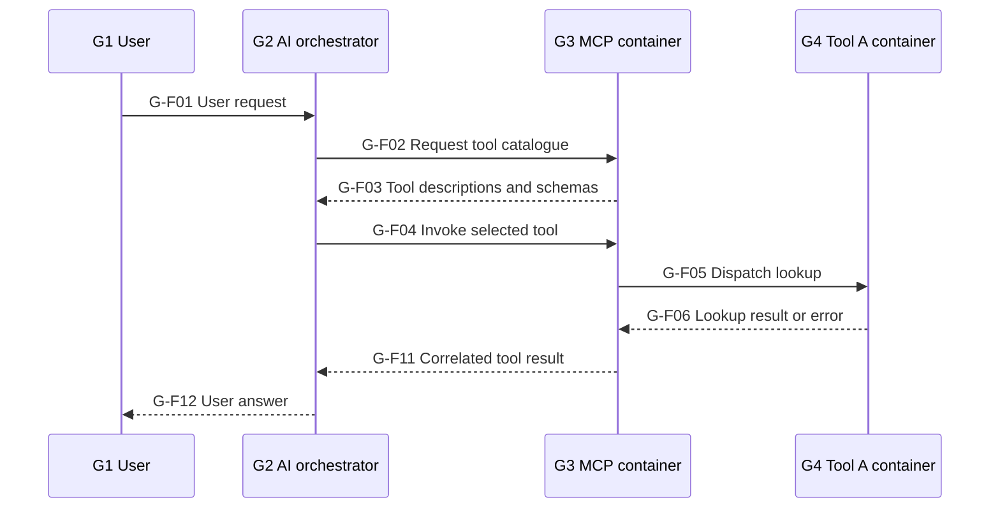
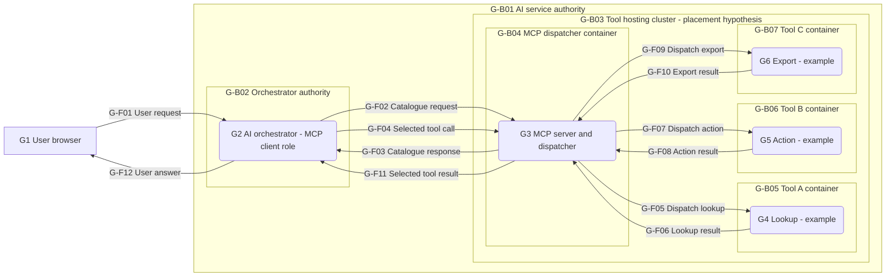

# Black-box threat modeling: three guided demonstrations

Build a useful threat model from a product description, even when you cannot see its code, infrastructure, or configuration. This workshop starts with an account-management website, progresses to ACME's corporate application and support bot, and finishes with an AI orchestrator invoking multiple tools through an MCP container and separate Kubernetes tool containers.

By the end of each setup, you will have a data-flow diagram, a record of uncertainty, generated threats reviewed in context, a business-specific threat register, and a locally saved model and report. **“Complete” here means complete for the supplied scope and information.** It does not mean that the real architecture is fully discovered or that the application has been tested.

Use [USAGE.md](USAGE.md) for the interface reference and [GUIDE.md](GUIDE.md) for additional modeling exercises.

## Contents

- [Workshop preparation](#workshop-preparation)
- [Setup 1: account website](#setup-1--accounts-sso-profile-pictures-and-an-ad-free-upgrade)
- [Setup 2: ACME and its support bot](#setup-2--acme-internal-boundaries-kubernetes-bedrock-and-action-logs)
- [Setup 3: AI orchestrator, MCP, and tool containers](#setup-3--ai-orchestrator-mcp-and-separate-kubernetes-tool-containers)
- [Review and handoff](#review-and-handoff-for-all-three-setups)

## Workshop preparation

Open the standalone `STRIDE.html` supplied by your maintainer. It works without installation or network access, including startup; see [README.md](README.md#use-it-offline). STRIDE does not contact the systems you draw, including Amazon Bedrock. Drawing a provider is just recording an architectural dependency.

The brief is enough to complete these demonstrations. If you later have authorized access to a target, observations can refine the model; visiting or testing that target is a separate activity from using STRIDE offline. Keep sanitized observations in notes and avoid putting live passwords, tokens, payment details, or customer data into the model.

Suggested classroom sequence:

| Session | Instructor's focus | Student's output |
| --- | --- | --- |
| Introduction | Separate facts, logical abstractions, and hypotheses. | Scope and evidence legend. |
| Setup 1 | Follow one user journey, then add recovery, SSO, uploads, and payments. | Website DFD and business-abuse threats. |
| Setup 2 | Follow a request through several authorities and an AI dependency. | ACME DFD, AI and logging threats, uncertainty register. |
| Setup 3 | Follow tool discovery, dispatch, execution, and the complete response path. | AI/MCP DFD with individual container boundaries and delegated-authority threats. |
| Handoff | Review evidence, preserve decisions, and explain remaining gaps. | Three `.stride` files and three reports. |

Use one model at a time. Save each setup before starting the next: **New model** replaces the current model, and browser autosave uses a shared recovery slot rather than a separate backup for each exercise.

### The evidence legend

Add a canvas **Note** with this legend using **T**. Copy relevant entries into **Menu → Model properties… → Assumptions** as well, so a report reader can understand the drawing.

| Label | Meaning | How to use it |
| --- | --- | --- |
| `[K]` Known | Explicitly stated in the brief, or supported by a recorded observation. | Include the source: `Brief`, or a sanitized evidence reference. |
| `[L]` Logical abstraction | A role or data movement needed to describe the stated behavior. | State that it is not a discovered server, deployment, or network hop. |
| `[H]` Hypothesis | One possible implementation chosen for investigation. | Record what would confirm or replace it. |
| `[U]` Unknown | Not established from the available information. | Leave relevant controls **Not Selected** and write a question. |

These labels are a documentation convention, not application fields with special engine behavior. Put them in element **Notes**, boundary names, and model assumptions. Flow IDs such as `W-F01` below are human-readable labels to put in the **Name** field; STRIDE creates its own internal identities.

**Instructor explanation:** “An account exists” supports an account-management function. It does not identify PostgreSQL, a session cache, a mail provider, or a cloud region. Likewise, an unknown control is not a control proven absent. Generated findings describe risks to review, not verified vulnerabilities.

### A repeatable way to draw

1. Write the user action and the valuable data it affects.
2. Identify the sender, the receiver that makes a decision, and any known storage.
3. Draw the trust boundary where authority changes.
4. Draw a named, directed flow; add a return flow when its data or trust implications matter.
5. Set only supported properties, inspect threats, and add business-specific scenarios.
6. Record evidence gaps and save a checkpoint.

Use **E** for an external entity, **P** for a process, **D** for a store, **B** for a boundary box, and **A** for a flow. Select a shape and set its exact stencil using **Type**. **Y** opens the symbol library; **/** searches stencils. Snap flow endpoints to nodes and check the source and target names in the properties panel.

For boundary boxes, the engine compares **node centers**: one inside and one outside means a crossing. An arrow passing through a box with both endpoint centers outside does not count as crossing it. Nested boxes do not imply firewall rules or verified isolation. A logical authority boundary can be useful without claiming a physical network segment.

The Mermaid diagrams in this document are teaching references, not files STRIDE can import. Reproduce the nodes, boundaries, and individual flows on the canvas. The flow tables are the detailed inventories; the pictures combine some arrows for readability.

## Setup 1 — accounts, SSO, profile pictures, and an ad-free upgrade

### Step 1 — Read the brief and define success

**Known behavior:** users can create an account, reset a password, use SSO, update profile information, upload a profile picture, and pay to upgrade. Upgraded accounts should not see ads.

Ask students to identify what an attacker would want to change or learn. Write these security objectives in the model description:

- Account creation, recovery, and SSO must bind the right identity to the right account.
- A member may change only their own permitted profile fields and image.
- Uploaded content must not gain execution privileges or access other users' data.
- The service must grant the ad-free entitlement only after the required payment is established.
- Sensitive profile, credential, and payment-related information must reach only intended recipients.
- Abuse must not make registration, recovery, uploads, or paid use unavailable; important decisions must be explainable afterwards.

**Instructor explanation:** the last two are security objectives. The brief has not established logging, encryption, availability controls, or their absence.

Create a new model with:

```text
Title: Setup 1 — account website — black-box baseline
Owner: Unassigned — website service owner to confirm
Reviewer: <student or class name>
High-level system description: Registration, password recovery, SSO, profile changes,
profile-picture upload, paid upgrade, and ad-free delivery.
Assumptions: Logical application view; implementation and protocols are unknown.
No control is treated as verified from the feature list alone.
External dependencies: SSO authority, exact ownership and integration unknown.
Payment, recovery-delivery, and advertising providers are not yet identified.
```

### Step 2 — Build a fact and uncertainty register

Keep this register in model assumptions or canvas notes. It is part of the model, not homework that must be resolved before drawing.

| ID | Classification | What we can say | What we still need |
| --- | --- | --- | --- |
| W-K1 | Known | Registration and password recovery exist. | Identity verification, recovery channel, token lifetime, and session invalidation. |
| W-K2 | Known | SSO is supported. | Provider, SAML/OIDC/other protocol, account linking, and validation behavior. |
| W-K3 | Known | Members can update information and a profile picture. | Allowed fields, image processing, storage, serving origin, and ownership checks. |
| W-K4 | Known | Payment upgrades an account; upgraded users do not see ads. | Payment authority, price calculation, confirmation route, entitlement lifetime, and ad delivery. |
| W-L1 | Logical abstraction | A server-side application makes account and entitlement decisions. | Whether that code is one application or several services. |
| W-L2 | Logical abstraction | An SSO authority supplies an identity result. | Whether it is third-party or organizational, and the actual browser/back-channel hops. |
| W-U1 | Unknown | Storage and infrastructure are not described. | Data stores, queues, hosts, network exposure, backups, and operating identities. |

Do not add a payment gateway, email server, SQL database, object bucket, or ad network yet. These are plausible, but the brief does not identify them. Internal state remains inside the application's logical box until evidence supports decomposition.

### Step 3 — Draw the smallest useful diagram

Start with the following nodes. Prefix their names with the teaching IDs if that helps students trace the tables.

| ID | Name | Kind → exact Type | Modeling reason |
| --- | --- | --- | --- |
| W1 | Visitor browser | External Entity → `Browser` | Registration, recovery, and beginning SSO do not require an already established account session in this logical view. |
| W2 | Member browser | External Entity → `Browser` | Represents the member interaction context; it can still send malicious requests. |
| W3 | Account web app | Process → `Web Application` | Logical owner of account, profile, and upgrade decisions. |
| W4 | SSO authority — integration unknown | External Entity → `Generic External Entity` | Identity authority outside this application's decision-making scope; not a claim that it is a separate company. |

Draw W1 and W2 on the left, W3 in the center, and W4 on the right. Draw a box around **W3 only**, named **Application authority [L]**, with **Type = Generic Trust Boundary**. Both browser states and the SSO authority remain outside.

The two browser nodes represent different interaction contexts, not two real computers. Do not mark the member browser Trusted because it can log in: authentication does not make client-supplied account IDs, amounts, or files authoritative.

First draw only **W-F04 Update profile information**, W2 → W3. Select W3 and click **View** to inspect its initial threats. Clear category/status/severity filters if necessary; View clears text search but retains these other filters. Notice that one small interaction already raises identity, input, authorization, and accountability questions.

**Checkpoint:** there are four nodes, one authority boundary, and one attached flow. W1 and W4 will temporarily be isolated until the next step; that is an incomplete drawing checkpoint, not a vulnerability.

### Step 4 — Expand the user journeys into flows

Add the remaining flows below. Set **Type = Generic Data Flow** on all twelve for the initial model. There is no evidence yet for HTTPS, a cookie, JWT, SAML, OIDC, a webhook, or a WebSocket.

Add the payload and evidence note from each row to the flow's **Notes**. The payloads describe logical information needed for the journey, not observed request field names.

| Flow name | Direction | Logical data and decision |
| --- | --- | --- |
| W-F01 Create account | W1 → W3 | Registration information; credential setup method unknown. Who controls the new account identity? |
| W-F02 Request password reset | W1 → W3 | Account identifier. Can the response reveal whether the account exists? |
| W-F03 Complete password reset | W1 → W3 | Recovery proof and replacement credential. Which account is changed, and can proof be reused? |
| W-F04 Update profile information | W2 → W3 | Proposed profile fields and account context. Which fields and account may this caller change? |
| W-F05 Upload profile picture | W2 → W3 | File bytes and metadata. How are they processed, stored, and later served? |
| W-F06 Request paid upgrade | W2 → W3 | Requested plan and account context; checkout mechanism unknown. Who establishes price and payment completion? |
| W-F07 Request member page | W2 → W3 | Request for content under the member's current entitlement. |
| W-F08 Return profile and member page | W3 → W2 | Profile content, image, tier-dependent page, and ad-display outcome. |
| W-F09 Return registration or recovery result | W3 → W1 | Acknowledgment or outcome; recovery-message delivery itself is still unknown. |
| W-F10 Begin SSO | W1 → W3 | SSO selection and return context; exact parameters unknown. |
| W-F11 Request SSO identity | W3 → W4 | Logical authentication request to an identity authority. |
| W-F12 Receive SSO identity result | W4 → W3 | Identity assertion/proof that the application will use for account access. |

W-F11 and W-F12 summarize the SSO integration. They do **not** assert direct network calls: a browser might carry an assertion or authorization code, and a separate exchange might occur. Write this limitation on both flows. Likewise, W-F06 summarizes the upgrade interaction; it is not evidence that the application directly receives card data.

For this exercise, record **Carries sensitive data = Yes** on all twelve flows as a conservative data-handling assumption: the journeys may contain identifiers, account context, images, or account outcomes. Label that classification `[H]` in notes and refine it when the actual payloads are known. Set **Carries credentials / tokens = Yes** on W-F03 and W-F12 because their logical payloads explicitly include recovery or identity proof. Leave that property **Not Selected** on the other flows.

**Instructor prompt:** trace how a profile picture gets from its uploader to a viewer. The model includes its upload and delivery but deliberately does not invent the processing library or storage backend. Record the missing steps as an evidence request.

### Step 5 — Record controls without inventing them

Use this baseline consistently:

| Element/property | Initial value | Reason |
| --- | --- | --- |
| W1 and W2 → Trust level | Untrusted | Client input remains attacker-controllable in either interaction context. |
| All other external-entity properties | Not Selected | Identity checks and the SSO authority's assurance have not been established. |
| W3 → all security properties, including Internet facing | Not Selected | A web interface does not by itself prove public Internet reachability or any control. |
| Every flow → Encrypted in transit, Integrity protected, Authentication, Replay protection, Rate limited | Not Selected | The brief names capabilities, not mechanisms or verified enforcement. |
| Sensitive-data and credential flags | As specified in Step 4 | These describe the data inventory, not security controls. |

Keep the nodes and flows in scope. Assessing the SSO integration does not require assessing the provider's implementation. Explain that limit in notes rather than hiding the integration's threats with **Out of scope**.

Missing values often satisfy rules written as “not Yes.” Thus an unencrypted-flow warning here means **transport protection needs evidence**, not “we observed cleartext.” Some rules need an explicit value and will not fire at all while it is unknown. Both kinds of uncertainty need human review.

### Step 6 — Read the generated threats as hypotheses

Open **Analysis**. Inspect the rule ID beside each finding number, the contributing flows, description, and suggested mitigation. Use the descriptions below as checkpoints, not as an exhaustive list or a target threat count.

| Rule | Expected result in this baseline | How the instructor should interpret it |
| --- | --- | --- |
| `S01`, `S02`, `S07` | Caller identity, destination identity, and missing/unknown flow authentication prompts appear on applicable inbound paths. | Investigate identity checks; not every public operation should require an existing login. |
| `T01` | One grouped finding for W3, including its inbound registration, recovery, profile, upgrade, page, and SSO paths. | Review each contributing action; a single generic validation claim does not cover all of them. |
| `T04` | Incoming paths to the Web Application prompt output-encoding review. | The rule does not prove a profile field or image is exploitable. Follow data through rendering. |
| `R01`, `D01`, `E02` | Grouped accountability, availability, and execution-risk prompts for W3. | Record which controls remain unknown and which dangerous processing paths need review. |
| `I01`, `T02`, `T05` | Applicable crossing flows prompt transport, integrity, and replay review. | Unknown encryption and replay protection produce investigation work. |
| `I03` | Credential-exposure prompts on W-F03 and W-F12. | These flows explicitly carry proof, while encryption is unknown. |
| `D05`, `E06` | Applicable external-to-process flows prompt abuse-limit and authorization review. | Distinguish public registration from member-only operations and record the intended policy per action. |
| `E04` | Absent initially: Authentication is not `Cookie / Session`. | Absence does not establish CSRF protection. Determine how the browser authenticates state-changing requests. |
| `P05` | Absent initially: no flow has Type `SAML` or `OAuth 2.0 / OIDC`. | SSO still needs review; use the manual SSO scenario below until the protocol is known. |
| `P07` | Absent initially: no `Webhook Callback` is established. | Payment confirmation is an open architectural question. |
| `P19` | Absent initially: W3's Internet facing property is unknown. | URL-fetch and network-reachability questions remain; do not infer their answer from this absence. |

**Optional evidence exercise, in a separately saved copy:** if an observation later establishes cookie authentication on W-F04, set **Authentication = Cookie / Session**. E04 will appear for that flow. If the flow is instead bearer-token authenticated, choose **Token (OAuth / JWT)**; E04 will not match it. Neither change proves the implementation's authentication or CSRF logic is correct.

If SSO is confirmed as OIDC, change the appropriate, newly detailed protocol legs to **OAuth 2.0 / OIDC**. P05 then applies. This subtype presets token authentication; inspect all properties and do not assume that it also establishes encryption or replay protection. If HTTPS is actually observed on a leg, that supports the encrypted transport setting for that leg only.

### Step 7 — Add the business threats the diagram cannot infer

Select the relevant node or flow, then choose **Analysis → + Add**. Use the IDs below in the manual threat titles. They are workshop labels, not new built-in rule IDs. Set the category and severity explicitly: manual threats initially default to Spoofing and Medium.

Every row below is an **Open hypothesis**. The suggested severities are provisional. Put the scenario in **Description**, the control in **Mitigation description** as a proposal, and the evidence request in **Notes**. Set Owner to **Unassigned — <suggested team> to confirm**, rather than inventing an accountable person.

| Manual title / attachment | Category; initial severity | Scenario and impact | Proposed mitigation and evidence to seek |
| --- | --- | --- | --- |
| W-M01 Account discovery through registration and recovery / W-F02 | I; Medium | Observable response differences reveal which identifiers have accounts. | Use suitable response behavior and abuse controls. Compare outcomes and timing for controlled existing/non-existing identities; owner: identity team. |
| W-M02 Recovery proof changes the wrong account or is replayed / W-F03 | S; High | A proof that is not bound to the intended account, expiry, and use can enable account takeover. | Bind proof to the account and action, limit lifetime/attempts, consume it once, and define session invalidation. Seek lifecycle and cross-account evidence; owner: identity team. |
| W-M03 SSO identity links to another member's account / W-F12 | S; High | An untrusted or incorrectly validated identity result, or unsafe linking by a mutable attribute, binds an attacker to a victim account. | Validate the protocol's issuer, intended recipient, integrity, freshness, and request correlation; require a justified account-linking policy. Seek protocol and linking evidence; owner: identity team. |
| W-M04 Profile update changes another account or protected fields / W-F04 | E; High | Client-selected account IDs or extra fields change another member's profile, role, or tier. | Derive the actor from the verified session, check object ownership, and allow only permitted editable fields. Seek two-account and protected-field test evidence; owner: application team. |
| W-M05 Profile picture becomes executable or unsafe rendered content / W-F05 | T; High | A crafted file or filename reaches a dangerous parser or is delivered as active content to another viewer. | Restrict supported formats and processing, safely generate storage names, isolate processing, and serve with appropriate content handling. Seek upload-to-viewer path and isolation evidence; owner: application team. |
| W-M06 Profile data or images are disclosed to the wrong viewer / W-F08 | I; Medium | Object references, response content, or caches expose private profile material beyond its intended audience. | Define profile/image visibility and enforce it on retrieval and caching. Seek evidence for the product's actual public/private policy; owner: application team. |
| W-M07 Unverified payment grants an ad-free entitlement / W-F06 | E; High | Client-controlled plan, amount, success flag, or repeated completion message upgrades an account without the required settled payment. | Establish price and entitlement server-side using the authoritative payment outcome, bind account/order/amount/currency, and make completion idempotent. Seek the payment-state transition and retry evidence; owner: billing team. |
| W-M08 Entitlement and ad delivery disagree / W-F08 | T; Medium | Stale tier state or a shared cache serves ads to an upgraded member, or a free account obtains paid access by changing client state. | Check authoritative entitlement where the benefit is delivered and vary/invalidate caches appropriately. Seek free-versus-paid, session-refresh, and cache evidence; owner: application/billing team. |
| W-M09 Account or billing decisions cannot be reconstructed / W3 | R; Medium | A recovery, profile, or upgrade dispute cannot be tied to the actor, decision, and outcome without exposing secrets. | Record attributable events with correlation and protected retention, excluding recovery secrets and payment credentials. Seek sample sanitized events and writer/reader permissions; owner: service operations. |
| W-M10 Recovery and image processing exhaust shared capacity / W-F05 | D; Medium | Bulk reset requests or costly file processing consume delivery, compute, or storage capacity. | Bound request rates, bytes, image dimensions, processing time, and per-account consumption. Seek limit and failure-isolation evidence; owner: application/platform team. |

Where a generated finding already covers the same risk, use its notes for the business detail and reference it instead of creating an unnecessary duplicate. Keep a manual entry where the business decision itself is not represented by the generic finding, particularly payment-to-entitlement binding.

**Instructor walkthrough for W-M07:** trace W2 → W3 on W-F06, then W3 → W2 on W-F08. Ask which component has authority to turn “payment requested” into “paid.” The honest answer is that the brief does not identify that authority. Keep the threat Open and request the missing confirmation path; do not draw a successful browser redirect as proof of payment.

### Step 8 — Arrive at the website model



Your final canvas has **4 nodes, 1 boundary, and 12 separate flows**, plus notes. It covers every stated capability and makes the unobserved integration details visible as questions. There is no requirement to guess a database or provider to make it a valid black-box model.

Before saving, ask students to explain these three paths aloud: recovery proof → account authority; uploaded bytes → member-visible content; payment claim → entitlement → ad-display decision. Each explanation must name a threat, a proposed control, and the evidence still needed.

Save as a versioned local file, for example **`setup-1-website-baseline.stride`**. Follow the common [review and handoff steps](#review-and-handoff-for-all-three-setups) below before moving on.

## Setup 2 — ACME, internal boundaries, Kubernetes, Bedrock, and action logs

### Step 1 — Establish what the more complex brief actually says

**Known behavior:** ACME exposes login, ordering, and a support bot. Its organization network has multiple internal trust boundaries. It uses Kubernetes containers in the LLM setup, and user actions are logged to a separate database inside the organization.

One phrase needs clarification: “host an LLM from Amazon Bedrock.” Bedrock is a **managed service accessed through APIs**; the brief does not establish that model weights run inside ACME's cluster. For this exercise, label the interpretation `[H]`: **a Kubernetes-hosted support application calls Amazon Bedrock for inference**. If ACME later confirms a self-hosted model, change the model accordingly. [AWS Bedrock overview](https://docs.aws.amazon.com/bedrock/latest/userguide/what-is-bedrock.html)

This setup is a black-box assessment informed by a few declared architectural facts. Those facts do not provide manifests, network policies, IAM policies, database permissions, or proof that “all actions logged” includes failed requests and trustworthy audit evidence.

Create a new model after saving Setup 1:

```text
Title: Setup 2 — ACME login, ordering, and support — black-box baseline
Owner: Unassigned — ACME service owner to confirm
Reviewer: <student or class name>
High-level system description: User login, order submission, support conversation,
Bedrock inference dependency, and internal user-action logging.
Assumptions: Portal is a logical combined login/order interface. Support application
is provisionally placed in Kubernetes and calls managed Bedrock. Internal zone
placement and direct arrows are logical hypotheses, not verified network topology.
External dependencies: Amazon Bedrock; model, region, routing, identity, and data
handling configuration unknown.
```

Identify the assets: authenticated identity, order ownership and correctness, conversation privacy, workload authority, provider invocation budget, availability of ordering, and trustworthy action history. An apparently helpful support bot must not become an alternate authority for orders or account access.

### Step 2 — Choose a defensible level of detail

| ID | Classification | Modeling statement | Evidence needed next |
| --- | --- | --- | --- |
| C-K1 | Known | Login, ordering, and support chat are exposed. | Entry points, authentication/session mechanism, roles, and object-ownership rules. |
| C-K2 | Known | Multiple internal trust boundaries exist. | Actual membership, service identities, allowed paths, and enforcement for each boundary. |
| C-K3 | Known | Kubernetes is used in the LLM setup. | Workload placement, runtime permissions, cluster ownership, and administrative reachability. |
| C-K4 | Known | A separate internal database records user actions. | Event coverage, producer path, retention, integrity, read access, and recovery. |
| C-H1 | Hypothesis | A combined logical portal forwards chat to a support application running in Kubernetes. | Confirm proxy/direct-browser paths and whether the bot is a distinct workload. |
| C-H2 | Hypothesis | That support application invokes managed Bedrock. | Confirm the integration, credential source, model endpoint, and data sent. |
| C-H3 | Hypothesis | Application execution, Kubernetes workload, and audit-write authority are distinct internal zones. | Map these logical separations to the real boundaries; do not assume separate VLANs or namespaces. |
| C-U1 | Unknown | Order storage, identity infrastructure, tools, retrieval, and deployment pipeline are not described. | Ask before adding their components or connections. |

**Instructor explanation:** complexity comes from different authorities and data handling, not the number of icons. Do not add Kafka, Redis, a WAF, a vector database, MCP, an identity server, or an ordering tool because they are common in enterprise diagrams.

### Step 3 — Place the nodes and draw internal boundaries

| ID | Name | Kind → exact Type | Notes to preserve |
| --- | --- | --- | --- |
| C1 | ACME user browser | External Entity → `Browser` | Untrusted caller; covers pre-login and signed-in requests as separate flows. |
| C2 | ACME portal — login and orders | Process → `Web Application` | `[L]` Combined user-facing behavior, not proof of one executable or host. |
| C3 | Support bot app — Kubernetes workload | Process → `AI Agent / LLM App` | `[H]` C-H1/C-H2. This stencil includes LLM applications; it does not assert autonomous tool use. |
| C4 | Amazon Bedrock — managed inference | External Entity → `LLM Provider API` | Integration is assessed; managed service internals are outside this view. |
| C5 | User-action log database | Data Store → `Database` | `[K]` Separate internal database; product, schema, and reader identities unknown. |

Lay out C1 on the far left; C2 and C3 in the middle; C5 below them; C4 on the far right. Draw these boxes, leaving the node centers clearly separated:

| Boundary name | Exact Type | Contents | Why draw it? |
| --- | --- | --- | --- |
| ACME organization [K; placement provisional] | `Corporate Network` | C2, C3, C5 and the three inner boxes | Keeps ACME's logical responsibilities separate from the caller and managed inference dependency. |
| Application execution [H: C-H3] | `Generic Trust Boundary` | C2 only | Portal authority is distinct from the proposed bot workload identity. |
| Kubernetes workload zone [H: C-H1] | `Kubernetes Cluster` | C3 only | Represents the declared Kubernetes environment and provisional workload placement. |
| Audit write authority [H: C-H3] | `Generic Trust Boundary` | C5 only | A database writer should have bounded authority over the separate action history. |

The inner boxes are siblings within ACME, not nested inside one another. C1 and C4 stay outside the ACME box. This layout is a **candidate logical decomposition**, not a claim that the database is physically isolated or that Kubernetes is on premises. ACME might operate its cluster in cloud infrastructure; the brief does not settle that.

**Checkpoint:** C2 → C3 crosses the application and workload boxes but not the outer organization box. C3 → C4 leaves both the workload and organization boxes. C2 → C5 crosses the application and audit boxes. These are three different review contexts even though some infrastructure is under the same organization.

### Step 4 — Follow a login, an order, and a conversation

Create the following **11 separate flows**, all initially **Generic Data Flow**. The arrows describe logical data movement. They do not establish a direct network connection or exclude an undiscovered gateway, queue, or logging collector.

| Flow name | Direction | Data and security decision |
| --- | --- | --- |
| C-F01 Log in | C1 → C2 | Identity proof; mechanism unknown. Which identity is established? |
| C-F02 Return login result | C2 → C1 | Authentication outcome and possible session material; exact contents unknown. |
| C-F03 Submit order | C1 → C2 | Requested items, quantities, and account context. Who may place this order and who determines authoritative values? |
| C-F04 Return order outcome | C2 → C1 | Order reference, contents, and status. Is the result scoped to its owner? |
| C-F05 Send support message | C1 → C2 | User-controlled text and conversation context. |
| C-F06 Forward support request | C2 → C3 | User text and any selected context. Authentication at C2 does not make the text trustworthy. |
| C-F07 Request inference | C3 → C4 | Prompt/context selected by the support application; exact fields and provider identity mechanism unknown. |
| C-F08 Receive model result | C4 → C3 | Model-generated material that must remain untrusted as input to ACME code. |
| C-F09 Return support answer | C3 → C2 | Model-influenced answer for subsequent rendering or application handling. |
| C-F10 Display support answer | C2 → C1 | User-visible response, possibly containing formatted content or links. |
| C-F11 Record user action | C2 → C5 | Logical record of login, order, and chat actions; precise producer pipeline and event fields unknown. |

Put C-H1 on C-F06/C-F09 and C-H2 on C-F07/C-F08. Note on C-F11 that C2 stands for the action-producing application behavior, not a verified database client. The brief supports action logging; it does not prove that the bot writes directly to the database. Therefore do not add that second write path to the baseline.

Do not add C3 → order service, C5 → C3, or customer → database paths. A chat capability does not establish order-changing tools, retrieval from logs, or direct storage access. The order database is also unknown; order state remains within C2's logical abstraction, separate from the known action-log database.

**Instructor walkthrough:** have a student follow C-F05 → C-F06 → C-F07 → C-F08 → C-F09 → C-F10. At each transition, name the data owner, the receiver's decision, and what the receiver must not assume. Then follow C-F11 and ask whether the event could be missing, forged, altered, or read by the wrong person.

### Step 5 — Set only the properties supported by this view

| Element/property | Baseline value | Interpretation |
| --- | --- | --- |
| C1 → Trust level | Untrusted | Signed-in users can still submit hostile orders or prompts. |
| C3 → Isolation | Container | Part of the explicitly labeled hypothesis that this app is the Kubernetes workload. |
| C5 → Stores log data | Yes | Action logging is stated in the brief. |
| Every flow → Carries sensitive data | Yes | `[H]` Conservatively classify account/order/chat/event context as sensitive until payload review. |
| C-F01 → Carries credentials / tokens | Yes | The logical login interaction carries identity proof; its exact mechanism is unknown. |
| All other security properties | Not Selected | Includes authentication, encryption, process authorization/validation, logging coverage, store access control, backup, and storage sensitivity. |

In particular, leave **C5 → Stores PII / sensitive data = Not Selected** until the actual stored event fields are known. Sensitive information on a write path may be redacted before storage. Also leave **C2/C3 → Logs security events = Not Selected**: the statement “user actions are logged” has not verified security-event coverage, attribution, outcomes, or resistance to suppression.

Do not translate “internal” into authenticated, encrypted, low privilege, or non-internet-facing without evidence. Do not select **API key** or **Token (OAuth / JWT)** as a stand-in for an unknown AWS identity mechanism; document mechanisms that have no exact dropdown option in Notes.

### Step 6 — Inspect AI, application, and logging findings

The following checks apply to the five nodes, eleven flows, four boxes, and properties above. Additional generic findings are expected; the table highlights the teaching points.

| Rule | Expected result | Teaching point |
| --- | --- | --- |
| `T01` | One group for C2 and one for C3. | Grouping collects inbound paths by target. Inspect contributors rather than treating a group as one endpoint test. |
| `A01` | One group on C3, contributed by C-F06. | User-controlled instructions remain a prompt-injection concern across the portal-to-bot boundary. Setting Validates input to Yes does not disable A01. |
| `A07` | One group on C3, contributed by C-F06 and C-F08 while their rate limits are unknown. | This rule also matches the provider's external-to-bot response path. Review its applicability; do not interpret it as evidence of two independent public inference endpoints. |
| `M04` | Appears on C-F07 to Bedrock. | Review the data selected for provider processing. The rule fires by provider subtype even before a specific sensitive payload is confirmed. |
| `A03` | Appears on C-F09, C3 → C2, while C2's input validation is unknown. | Model-influenced output can become dangerous HTML, queries, commands, or other application input depending on the actual sink. Those sinks must be investigated, not presumed. |
| `A04`, `A16` | Element findings on C3. | Review prompt disclosure and unsafe reliance on answers. Neither requires a discovered secret or a demonstrated incorrect answer. |
| `A05` | Appears on C3 while Authorizes requests is unknown. | Determine what actions the app actually performs. The finding does not prove that the bot can change orders or call tools. |
| `R01`, `D01`, `E02` | Groups for C2 and C3 under these boundaries and unknown controls. | Internal workloads still need attributable operations, bounded capacity, and safe input handling. |
| `T03`, `T06`, `R03`, `R04`, `D03`, `D04` | Applicable prompts on C-F11 and its database target. | Review safe writes, event authenticity, bounded writer privileges, capacity, and loss of the logging path. Database subtype is generic; query details remain unknown. |
| `X04` | Appears on C5 because Backed up is not Yes. | Recoverability needs evidence. An action log can be an important asset even if its schema is unknown. |
| `X01` | Absent initially because no store sensitivity/credential flag is Yes. | Unknown content is not proof that log encryption is unnecessary. Inspect the stored fields before refining this property. |

There are also useful **coverage limits** to teach:

- `A06` does not match the bot's Bedrock request: `LLM Provider API` is excluded. The actual user response is C2 → C1, whose source is a Web Application, so this architecture also has no direct bot-to-user A06 match. Record end-to-end answer disclosure manually; the engine does not follow data through intermediate processes.
- `A01` excludes C-F08 because its source is `LLM Provider API`. That does not make provider output safe. A03 covers the modeled onward C3 → C2 leg; C3's own handling of provider output still needs review.
- `C01` requires a `Kubernetes Pod` or `Container / Pod` subtype. Setting Isolation to Container on an `AI Agent / LLM App` does not trigger it. Preserve the app subtype for AI coverage and record workload-escape/privilege risk manually in this combined view. Do not create a duplicate runtime node just to increase the count.
- `P18` does not apply merely because a target database contains logs. It needs a `SIEM / Log Collector` target or a `Syslog` flow. Here, R04 and the manual event-integrity scenario carry that review.
- `A02`, `A08`–`A15`, `C02`, and MCP-specific findings are not expected in this baseline. No retrieved store content, vector database, model artifact, self-hosted model endpoint, control-plane node, or MCP integration has been established.

**Optional control experiment in a copy:** set C2's **Validates input = Yes**. Its T01 and C-F09's A03 cease to match, but C3's A01 remains. If you had edited the disappearing findings, STRIDE may retain them as orphans. The demonstration shows rule behavior; a single boolean is not evidence that all model-output sinks are safe.

### Step 7 — Complete the ACME threat register

Use the same manual-entry procedure as Setup 1. Keep these hypotheses **Open** with provisional severity and an owner to confirm. Expand an existing generated finding where it already represents the same issue.

| Manual title / attachment | Category; initial severity | Scenario and impact | Proposed mitigation and evidence to seek |
| --- | --- | --- | --- |
| C-M01 Login identity is reused outside its intended scope / C-F01 | S; High | Incorrect session/token validation or lifecycle binds an attacker to another identity or preserves access after it should end. | Enforce the actual authentication protocol and session lifecycle; seek issuer/session, logout, expiry, and account-binding evidence. Owner: identity team. |
| C-M02 An order uses unauthorized ownership or client-supplied authority / C-F03 | E; High | A user supplies another account or changes authoritative order attributes to act beyond their entitlement. | Enforce object/tenant ownership and server-side order policy on each action. Seek two-user and protected-field evidence. Owner: ordering team. |
| C-M03 Retries or concurrent submissions corrupt order outcomes / C-F03 | T; High | Replayed or parallel requests create duplicate orders or inconsistent state. | Bind idempotency and state transitions to the caller and intended operation. Seek retry/concurrency handling and reconciliation evidence. Owner: ordering team. |
| C-M04 Prompt instructions cross from conversation into authority / C-F06 | E; High | User text or a model answer is treated as an authorization decision rather than untrusted content. | Enforce permissions outside prompts and limit capabilities. Establish whether tools or order actions exist before assessing them. Seek allowed-action and downstream enforcement evidence. Owner: support application team. |
| C-M05 Support answer discloses another user's conversation or order data / C-F10 | I; High | Context selection, shared conversation state, or response routing leaks information to the wrong caller through C3 → C2 → C1. | Bind context and responses to the real caller and conversation; minimize provider-bound data. Seek isolation and context-selection evidence. Owner: support application team. |
| C-M06 Model output becomes active content or an unsafe application argument / C-F09 | T; High | Generated text is rendered or used by code with more authority than ordinary user text. | Use context-specific encoding and constrained schemas; keep dangerous execution behind explicit application policy. Inventory actual sinks and review each one. Owner: application team. |
| C-M07 Compromised support workload exceeds its Kubernetes authority / C3 | E; High | Workload credentials or runtime privileges allow access beyond the bot's required resources. | Apply least-privilege workload identity, restricted runtime permissions, bounded network access, and separation from administration. Seek manifests, role bindings, and effective-policy evidence. Owner: platform team. |
| C-M08 Action history is forged, suppressed, or overwritten / C-F11 | R; High | A user-controlled event field or compromised writer changes the apparent actor/outcome, removes evidence, or stops events arriving. | Establish trusted actor/correlation fields, constrained writes, protected retention, and observable delivery failures. Seek event-to-request correlation and database permission evidence. Owner: logging/platform team. |
| C-M09 Logs retain secrets or expose private user activity / C5 | I; High | Logging captures credentials, private conversation content, or order details accessible to excessive readers. | Define minimal event fields, redaction, retention, and reader permissions. Seek a sanitized schema/sample and access policy. Owner: data/logging team. |
| C-M10 Chat consumption or logging failure degrades ordering / C-F07 | D; Medium | Costly conversations, provider delay, or blocked event writes consume resources needed for login and orders. | Bound inference input/output and concurrency, set per-user budgets and timeouts, isolate capacity, and define logging failure behavior. Seek dependency-failure and limit evidence. Owner: application/platform team. |

**Instructor walkthrough for C-M08:** the brief already claims that actions are logged. Ask a student to explain why that does not close repudiation threats. A useful event must describe the right actor and outcome, arrive reliably, resist unauthorized modification, and be retrievable by the right reviewer. The database's mere existence establishes none of those properties.

For advanced students, trace a conditional chain: malicious support input → compromised application or unsafe output handling → misuse of workload authority → unauthorized data access or altered action history. Mark every unconfirmed edge as conditional. Prompt injection alone does not establish container escape, database access, or arbitrary code execution.

### Step 8 — Arrive at the ACME model



Your final canvas has **5 nodes, 4 boundary boxes, and 11 separate flows**, plus notes. The model represents the stated capabilities and declared technologies while keeping uncertain implementation details visible. Save **`setup-2-acme-baseline.stride`**.

The current answer to “does the bot retrieve order data, use MCP, or execute transactions?” is **unknown**. No corresponding arrow is a claim that those capabilities are absent. Record them as discovery questions in the handoff.

### Step 9 — Extend only when the next fact arrives

This is an advanced follow-up, not additional baseline architecture.

| New evidence | Appropriate model change | Review consequence |
| --- | --- | --- |
| Website SSO is OIDC or SAML | Replace the logical SSO arrows with the observed browser and server legs using the exact protocol subtypes. | P05 applies; distinguish application session authentication from the identity exchange. |
| A payment service confirms upgrades through a callback | Add the known provider and receiving process; model the callback as `Webhook Callback`. | P07 applies while Integrity protected is not Yes; independently review payment binding, replay, and idempotency. |
| Profile pictures are fetched by URL | Add the actual fetcher and destination path, including any reachable internal services established by evidence. | Assess SSRF and fetch restrictions; an upload field alone did not establish this capability. |
| An external ad service receives browser or application data | Add the actual recipient and request/response legs. | Review disclosure, script authority, consent requirements in scope, and whether upgraded pages still make those calls. Hidden ads and absent ad requests are different observations. |
| ACME has distinct login and order services | Split C2 according to the real identities and data paths. | Reassess token propagation and authorization; new element identities require review of their findings. |
| Chat connects directly from the browser to the bot | Replace or supplement C-F05/C-F06 and C-F09/C-F10 with observed paths. | A03 and A06 can then apply to the bot-to-browser response; inspect the real transport instead of assuming WebSockets. |
| A vector store supplies retrieved passages | Add `Vector Database` and the actual retrieval/ingestion flows. | A02/A08/A09 become relevant when their conditions match; A10 needs Stores PII / sensitive data = Yes. |
| An MCP client/server integration exists | Add the exact `MCP Client / AI Assistant`, `MCP Server`, and relevant flows in the roles actually observed. | Check A15 and the M-series against those endpoints; their existence is not implied by a support chatbot. |
| A model really runs inside ACME's infrastructure | Add a justified `ML Model Serving` process, artifact source if known, and actual callers. | Investigate artifact trust and model exposure; A13/A14 require their specific source, flow, and control conditions. |
| Kubernetes roles and administrative paths are provided | Create a justified platform view with `Kubernetes Pod`/`Container / Pod` and a control-plane node where in scope. | C01/C02 coverage can apply. Separate diagrams have independent identities and reviews; findings are not automatically linked or deduplicated across views. |

## Setup 3 — AI orchestrator, MCP, and separate Kubernetes tool containers

### Step 1 — State the complete journey and its limits

The new brief establishes this path:

```text
Request: User → AI orchestrator → MCP container → selected tool container
Result:  Selected tool container → MCP container → AI orchestrator → User
```

The user's request reaches the relevant tool through the MCP container, and the result returns through the same intermediaries to the user. The MCP container exposes multiple tools; the tool implementations run in separate Kubernetes containers. A tool is an operation, while a container is an execution environment: the two concepts should not be confused.

For this walkthrough, interpret the MCP container as an **MCP server and dispatcher**, and the orchestrator as an **AI application that also acts as its MCP client**. Label that role assignment `[L]`. Use three example tools so students can practice different permissions:

| Example tool | Illustrative operation | Why model it separately? |
| --- | --- | --- |
| Tool A — lookup | `lookup_record` reads a permitted record. | Read access can disclose information without changing anything. |
| Tool B — action | `update_record` changes a permitted record. | A state-changing action needs narrower authority and replay/approval review. |
| Tool C — export | `create_export` produces a result for the caller. | Bulk output can disclose more than an individual lookup and consume substantial resources. |

These names and capabilities are **classroom hypotheses**, not facts supplied about ACME or any deployment. Record them as G-H1 and replace them with the real tool inventory when available. Their actual data stores, external destinations, implementation languages, and credentials remain unknown; do not add invented database or internet connections.

The model/provider used by the orchestrator is also unspecified. Keep inference inside its logical abstraction for now. This third setup does not automatically inherit Bedrock, the logging database, or the deployment details from Setup 2. Add those dependencies and their flows only if this architecture is confirmed to use them.

Create a new model:

```text
Title: Setup 3 — AI orchestration with MCP and separate tool containers
Owner: Unassigned — AI service owner to confirm
Reviewer: <student or class name>
High-level system description: User request, orchestration, MCP tool selection and
dispatch, execution in separate Kubernetes containers, and response to the user.
Assumptions: G-H1: lookup/action/export are illustrative tool capabilities.
G-H2: one MCP dispatcher and three tool containers share one Kubernetes cluster;
the orchestrator's hosting is unknown. Pod and namespace placement are unknown.
Logical authority boxes do not establish independent credentials or enforced isolation.
External dependencies: Model/provider and downstream tool resources unknown.
```

**Instructor explanation:** the security question is not just whether the tool ran. Ask whether the **right user**, through the **right service identities**, invoked the **permitted tool and operation**, against the **permitted object**, and received only the **permitted result**.

### Step 2 — Draw the six nodes using their functional roles

| ID | Name | Kind → exact Type | What the node means |
| --- | --- | --- | --- |
| G1 | User browser | External Entity → `Browser` | The caller supplies requests and receives the final answer. |
| G2 | AI orchestrator — MCP client role | Process → `AI Agent / LLM App` | Chooses tools and arguments, coordinates calls, and constructs the response. |
| G3 | MCP server and dispatcher container | Process → `MCP Server` | Exposes the tool catalogue and routes an allowed call to its implementation. |
| G4 | Tool A container — lookup | Process → `Container / Pod` | Separate container implementing the hypothetical lookup capability. |
| G5 | Tool B container — action | Process → `Container / Pod` | Separate container implementing the hypothetical state-changing capability. |
| G6 | Tool C container — export | Process → `Container / Pod` | Separate container implementing the hypothetical export capability. |

Use **AI Agent / LLM App** for G2 to retain AI-specific review coverage. Its name and notes preserve the orchestration and MCP-client roles. Each node has one Type; it cannot simultaneously be `AI Agent / LLM App`, `Orchestrator (Workflow / Agents)`, and `MCP Client / AI Assistant`. We will explicitly cover the resulting rule gaps in Step 7.

Use **Container / Pod** for G4–G6 because separate containers are known, but separate Pods are not. Do not draw three Kubernetes Pods as a discovered fact. Similarly, retain **MCP Server** for G3 and set its isolation property to Container rather than duplicating the same component under another subtype.

### Step 3 — Draw boundaries around authority and execution

Place G1 on the far left, G2 next, G3 in the middle, and G4/G5/G6 in a vertical column on the right. Draw these **seven boundary boxes**:

| Boundary | Exact Type | Contents | Review at this transition |
| --- | --- | --- | --- |
| G-B01 AI service authority [L] | `Generic Trust Boundary` | G2–G6 and all their inner boxes | Untrusted user input enters service-controlled processing; results leave for a particular user. |
| G-B02 Orchestrator authority [L] | `Generic Trust Boundary` | G2 only | Conversation context and tool proposals must not become unrestricted execution authority. |
| G-B03 Tool hosting cluster [H: G-H2] | `Kubernetes Cluster` | G3–G6 and their four container boxes | Review entry to the tool-hosting environment and the scope of its identities. |
| G-B04 MCP dispatcher container [K container; H placement] | `Container Boundary` | G3 only | The dispatcher validates the caller, selects a registered tool, and delegates bounded authority. |
| G-B05 Tool A container [K separation; H capability] | `Container Boundary` | G4 only | Lookup code should receive only its allowed request and read permissions. |
| G-B06 Tool B container [K separation; H capability] | `Container Boundary` | G5 only | State-changing code must enforce its own operation/object policy. |
| G-B07 Tool C container [K separation; H capability] | `Container Boundary` | G6 only | Export scope, recipients, output size, and processing budget need control. |

G-B02 and G-B03 are siblings inside G-B01. G-B04–G-B07 are siblings inside G-B03. G1 remains outside every box. A box represents the place where trust or execution context changes; its existence does not prove that the change is enforced securely.

**Kubernetes distinction:** containers in the same Pod share its network namespace, including IP address and ports. Kubernetes NetworkPolicy selects Pods, and enforcement requires a supporting network implementation. Separate container icons therefore do not establish separate network identities or blocked lateral access. Record Pod placement, workload credentials, shared volumes, and effective policies as evidence requests. [Kubernetes Pods](https://kubernetes.io/docs/concepts/workloads/pods/), [NetworkPolicy](https://kubernetes.io/docs/concepts/services-networking/network-policies/)

If stronger isolation is required, review an explicit design using appropriate workload separation, least privilege, and enforced access policies. Do not set those properties to safe values merely because you drew a namespace or container boundary.

**Checkpoint:** G1 → G2 crosses G-B01 and G-B02. G2 → G3 crosses G-B02, G-B03, and G-B04. G3 → G4 crosses G-B04 and G-B05 while staying inside the cluster. Reverse results cross the same boundaries and must be reviewed as their own data flows.

### Step 4 — Inventory discovery, calls, and results

First draw the six-arrow path through Tool A. Then add Tool B and Tool C's dispatch/result pairs. Finally add tool discovery as a separate logical exchange: metadata can influence the orchestrator before any tool executes.

MCP exposes tool discovery through `tools/list` and invocation through `tools/call`. The discovery exchange below is a useful protocol-level decomposition; its actual timing, caching, and refresh policy are not supplied by the brief. [MCP tools specification](https://modelcontextprotocol.io/specification/latest/server/tools)

| Flow name | Direction | Exact Type | Data and decision to investigate |
| --- | --- | --- | --- |
| G-F01 Submit user request | G1 → G2 | `Generic Data Flow` | Prompt and conversation context; establish the user and allowed task. |
| G-F02 Request tool catalogue | G2 → G3 | `MCP (JSON-RPC)` | Logical `tools/list` request; which tools should this client/user be offered? |
| G-F03 Return tool catalogue | G3 → G2 | `MCP (JSON-RPC)` | Tool names, descriptions, and schemas; can changed metadata manipulate selection or arguments? |
| G-F04 Invoke selected tool | G2 → G3 | `MCP (JSON-RPC)` | Logical `tools/call` with tool name and arguments; how are caller, user, operation, and approval bound? |
| G-F05 Dispatch lookup | G3 → G4 | `Generic Data Flow` | Tool A's selected operation and scoped inputs; verify effective read authority. |
| G-F06 Return lookup result | G4 → G3 | `Generic Data Flow` | Tool A's result/error and correlation context; treat content as untrusted. |
| G-F07 Dispatch action | G3 → G5 | `Generic Data Flow` | Tool B's proposed state change; enforce ownership, approval where required, and replay policy. |
| G-F08 Return action result | G5 → G3 | `Generic Data Flow` | Authoritative operation outcome; distinguish success, rejection, failure, and unknown completion. |
| G-F09 Dispatch export | G3 → G6 | `Generic Data Flow` | Tool C's requested scope and limits; prevent an unrestricted export. |
| G-F10 Return export result | G6 → G3 | `Generic Data Flow` | Export content or a reference; recipient and retrieval behavior remain to be established. |
| G-F11 Return selected tool result | G3 → G2 | `MCP (JSON-RPC)` | Result/error for the matching invocation; preserve provenance without turning content into instructions. |
| G-F12 Return user answer | G2 → G1 | `Generic Data Flow` | Final answer or operation outcome; disclose only permitted data and render it safely. |

For a lookup, trace **G-F01 → G-F04 → G-F05 → G-F06 → G-F11 → G-F12**. Tool B substitutes G-F07/G-F08; Tool C substitutes G-F09/G-F10. One selection does not imply that all tools execute. Discovery G-F02/G-F03 can precede the call or use a reviewed cached catalogue.

The backend protocol between the MCP dispatcher and each container is unspecified. Keep those arrows generic; a tool implementation behind an MCP server does not necessarily expose MCP itself. Also keep user transport generic until observed. **MCP (JSON-RPC)** alone does not establish TLS, a particular transport, authentication, or secure token delegation.

Do not add user → tool, orchestrator → tool, or tool → sibling-tool paths to the baseline. Their absence records the described route, not proof that bypass access is blocked. Ask whether callers can reach a container directly and test that claim only within the authorized environment.



**Instructor prompt:** ask students to point to the proposed decision-maker at each arrow. User text may propose a task; model output may propose a tool call. Neither is an authorization credential. Tool code must enforce policy using verified context, not an arbitrary `userId` supplied in model-generated arguments.

### Step 5 — Set baseline properties and preserve unknowns

| Element/property | Baseline value | Reason |
| --- | --- | --- |
| G1 → Trust level | Untrusted | The caller can supply hostile prompts and arguments. |
| G3–G6 → Isolation | Container | Container execution is part of the stated setup; cluster placement is G-H2. |
| All twelve flows → Carries sensitive data | Yes | `[H]` Conservative classification of user context, tool metadata, arguments, and results pending payload review. |
| All other security properties | Not Selected | Authentication, authorization, validation, runtime privilege, encryption, rate limits, logging, and replay controls are unverified. |

In particular, leave G2's hosting/isolation unknown and G3–G6's **Running as** unknown. A container can still execute with excessive privilege. Do not set **Authorizes requests = Yes** because the orchestrator has a system prompt that says to check permissions.

Caller authentication and delegated user authorization are distinct. A valid service connection identifies a workload; the receiver must still establish which user and operation it may act for. Record the intended credential audience and scope per hop in Notes when known, without placing raw tokens in the model or prompt.

### Step 6 — Check generated findings against this exact model

Open **Analysis**, clear filters, and examine the relevant IDs and contributing paths. These are current engine expectations with the baseline settings, not evidence of vulnerabilities or a comprehensive AI security assessment.

| Rule | Expected result | Interpretation |
| --- | --- | --- |
| `A01` | One group on G2 from G-F01. | Direct prompt injection remains relevant even if syntactic input validation is later declared. MCP-origin catalogue/results are excluded from this rule. |
| `M01` | Matches G-F03, G-F05, G-F07, G-F09, and G-F11 because their source is G3. | Tool metadata/results are the central poisoning concern. The rule is broad and also fires on dispatches to non-model tool containers; assess the description's fit per path. |
| `M02`, `M03` | Match G-F02, G-F04, G-F06, G-F08, and G-F10 because their target is G3. | Review excessive tool authority and confused-deputy/token handling. Tool-return matches are also broad prompts, not proof that a tool result is a new tool invocation. |
| `A03` | Matches G-F04 and G-F02 while G3's validation is unknown, and G-F12 to the Browser. | Invocation arguments and browser rendering are important sinks. A catalogue request may not contain generated content; justify that case separately. Browser output remains a prompt even if a receiver validation flag is set. |
| `A04`, `A05`, `A16` | Element findings on G2. | Review prompt disclosure, authority outside prompts, and reliance on unverified outputs. |
| `A06` | Matches G-F12, G2 → G1. | Check that the final answer and any export references belong to the actual caller. |
| `A07` | One group on G2 with G-F01, G-F03, and G-F11. | Unknown rate limits plus external input or boundary crossings produce the matches. The group includes metadata/results; distinguish bounded responses from user-triggered recursion or uncontrolled consumption. |
| `C01` | One element finding on each of G4, G5, and G6. | Their container subtype and unverified runtime privileges require escape/isolation review. |
| `T01`, `R01`, `D01`, `E02` | One group per process: G2, G3, G4, G5, G6. | Each receives boundary-crossing input under unknown controls. Inspect call and return contributors separately. |

**Instructor explanation:** rule matching is local to a flow or element. It does not understand an entire call stack, prove that a result belongs to the correct request, or distinguish a schema request from a tool call based on the flow name. Keep the broad rule prompts, explain non-applicable cases, and add the missing end-to-end scenarios below.

### Step 7 — Cover subtype and architecture gaps explicitly

- `A15` does not fire: G2 acts as an MCP client but its subtype is `AI Agent / LLM App`, not `MCP Client / AI Assistant`. Record the orchestrator-to-MCP client-authentication and user-delegation review manually.
- `O01` and `C03` require `Orchestrator (Workflow / Agents)`. They do not fire merely because G2 is named “orchestrator.” Keep the AI subtype and add workflow/instruction and central-authority risks manually. If the component is actually a deterministic workflow engine, choose the more accurate subtype and revisit AI coverage.
- `C01` does not fire on G3: it is an `MCP Server` with Isolation = Container. Record its container/runtime risk manually as well as the generated G4–G6 risks.
- `A02` does not match G3 → G2 because an MCP server is not a store or the specified third-party-content subtype; M01 provides the MCP-origin poisoning prompt. The tool implementations may retrieve hostile content, but their unknown downstream paths are not silently inferred.
- `M04`, `A08`–`A14`, and `C02` are absent: no provider node, vector store, training/model artifact, model-serving node, or control-plane node has been specified. The absence is a scope/evidence limitation, not a finding that these risks cannot exist.

Do not add an extra external “MCP client” or duplicate G2/G3 just to make these IDs appear. The drawing should represent actual components and authority; manual threats cover the combined roles honestly. If a later platform view separates runtime and application details, document its correspondence and remember that reviews are not shared across diagrams.

### Step 8 — Add an end-to-end threat register

For each row, attach a manual threat to the indicated element/flow, or enrich an existing generated finding and cite the workshop label. Begin **Open**, use a provisional severity, and set the responsible team as **Unassigned — <team> to confirm**. The controls are proposals until supported by evidence.

| Manual title / attachment | Category; initial severity | Scenario and impact | Proposed control and evidence to seek |
| --- | --- | --- | --- |
| G-M01 Caller or delegated user is substituted / G-F04 | S; High | A caller reaches the MCP server as a trusted service, or supplies another user's identity, without valid authority for that user. | Authenticate the immediate caller and validate delegated identity, intended recipient, and scope. Require verified context at the tool, not a model-chosen user ID. Seek negative identity/delegation checks; owner: identity/platform team. |
| G-M02 Tool metadata changes the intended workflow / G-F03 | T; High | A poisoned description or schema causes the orchestrator to choose a dangerous operation or disclose data. | Review and control trusted catalogue sources and changes; keep metadata/content separate from policy. Seek tool inventory/change-review evidence; owner: AI/MCP team. |
| G-M03 Tool name or arguments dispatch to excessive capability / G-F04 | E; High | A model-selected name, route, object, or argument causes an unauthorized tool operation. | Allow only registered dispatch mappings, validate operation-specific arguments, and authorize the caller/object at execution. Seek lookup-versus-action permission tests; owner: MCP/tool teams. |
| G-M04 Token passthrough turns the dispatcher into a confused deputy / G3 | E; High | A credential accepted for one recipient is forwarded or reused at a more privileged backend. | Validate intended recipients and use appropriately scoped downstream identity/delegation; do not blindly forward client credentials. Seek the per-hop identity design; owner: identity/MCP team. |
| G-M05 Approval or replay applies to the wrong action / G-F07 | T; High | A high-impact action changes after approval, or a retry repeats a completed state change. | Where approval is required, bind it to caller, tool, exact operation/arguments, and validity period; enforce operation-bound idempotency and reauthorization. Seek retry, changed-argument, and failure-state evidence; owner: tool team. |
| G-M06 Tool output becomes a new instruction / G-F11 | T; High | Hostile returned text causes an extra tool call, changed workflow, or disclosure unrelated to the user's authorized request. | Treat output as untrusted data, constrain follow-on actions, and reapply authorization independently of model reasoning. Seek controlled hostile-result handling; owner: AI team. |
| G-M07 A result is delivered to another user or invocation / G-F12 | I; High | Concurrent calls, shared state, or export references bind a valid tool result to the wrong conversation or user. | Preserve server-controlled correlation and caller ownership across every hop; restrict retrieval of any exported result. Seek two-user concurrent-call evidence; owner: application/tool teams. |
| G-M08 Direct access or sibling access bypasses tool policy / G4 | E; High | A caller bypasses G3, or one compromised tool reaches another tool using shared permissions. | Enforce receiver-side authorization and least-privilege access paths; verify Pod placement, identities, and effective networking rather than trusting the diagram. Seek allowed/denied reachability evidence; owner: platform team. |
| G-M09 The MCP container exceeds its runtime authority / G3 | E; High | Dispatcher compromise exposes broad credentials, shared volumes, or privileges beyond the required dispatch role. | Restrict runtime privileges, credential exposure, mounts, and administrative access. Seek effective workload configuration; owner: platform team. Apply equivalent review to generated C01 tool findings. |
| G-M10 Tool activity cannot be attributed end to end / G3 | R; Medium | A returned message claims success but the initiating user, selected tool, approved action, or actual outcome cannot be reconstructed. | Correlate attributable decisions and outcomes across user, orchestrator, dispatcher, and tool; protect evidence without logging secrets. Seek a sanitized full-call trace and error handling; owner: service operations. |
| G-M11 Recursive calls or oversized results exhaust shared capacity / G2 | D; Medium | Tool loops, repeated failures, costly exports, or large results consume the service's budget and capacity. | Bound tool-call depth/count, input/output size, time, concurrency, and per-user consumption; propagate deadlines/cancellation and isolate tool capacity. Seek bounded-failure evidence; owner: AI/platform team. |

**Instructor exercise:** use the hypothetical Tool B to discuss a requested update. Trace where caller identity is established, where an object-ownership decision is made, where any required approval is bound to that update, how the actual outcome is returned, and what reaches the user's screen. Any answer such as “the prompt tells it not to do that” leaves an authorization question unresolved.

Next, switch to Tool A and consider a malicious string in a legitimate result. This is a different entry point from the original user prompt. The receiving MCP server and orchestrator must not upgrade that string into policy simply because it came from an internal container.

### Step 9 — Arrive at the complete tool-chain model



The completed baseline has **6 nodes, 7 boundary boxes, and 12 separate flows**, plus notes and the threat register. Tool definitions are metadata on G3's catalogue path; tool implementations are G4–G6 in their own containers. There is no shortcut that omits the MCP return path.

Before closing the exercise, have students check these properties of their drawing and reasoning:

1. A single Tool A/B/C invocation can be traced from user to selected container and all the way back, with different call and result arrows.
2. The MCP server's exposure of several tools does not grant every caller access to all of them.
3. Each tool's data and action authority is reviewed separately, even inside one cluster.
4. The reverse path contains two distinct untrusted inputs: tool metadata/results entering the orchestrator, and the final model-influenced answer entering the browser.
5. Unknown authentication, permissions, network isolation, and model/tool dependencies remain visible in the assumptions and evidence requests.

Save **`setup-3-ai-mcp-tool-chain-baseline.stride`**, reopen it, and export its report using the common handoff steps. Preserve the other two setups in their own saved files.

### Step 10 — Run controlled learning experiments in a copy

These changes illustrate engine behavior and review coverage. They are not claims that the real controls are implemented.

- Set G3's **Validates input = Yes**. G3's T01 and the A03 prompts on G-F02/G-F04 stop matching. A01 on the user-to-orchestrator path, M02/M03, and A03 on the browser response remain. Parsing valid arguments does not establish tool authorization or prompt-injection resistance.
- Set G4's **Running as = Low privilege / sandboxed**. Its C01 stops matching; G5/G6's remain. That single property does not verify kernel isolation, shared-volume permissions, or network policy.
- In the exercise copy, review the current G2 T01 group and record a non-open decision. Add another distinct MCP-result flow G3 → G2. It joins the group and requires review; the earlier notes stay visible. Inspect **New flows since review** before confirming status for all current contributors.
- In a separate copy, change G2's subtype to **Orchestrator (Workflow / Agents)**. O01 appears on its inbound flows and C03 on the element, while AI-subtype-specific findings change. Restore the accurate subtype afterwards and inspect any retained orphans. A different threat count reflects rule selection, not a safer system.

## Review and handoff for all three setups

### 1. Turn a generated prompt into a reviewable record

Choose one grouped T01 finding and inspect every contributing flow. Use a notes template such as:

```text
Evidence basis: Supplied feature/architecture brief only.
Classification: Open hypothesis; no vulnerability confirmed.
Paths reviewed: <flow labels examined in this modeling session>.
Missing evidence: <specific control or architecture question>.
Impact: <asset and possible consequence>.
Proposed control: <where it must be enforced>.
Next owner: Unassigned — <team> to confirm.
```

“Paths reviewed” here means examined during modeling, not successfully tested or mitigated. Keep **Status = Open** when supporting control evidence is missing. A mitigation suggestion copied into a field is still a proposal.

Use **Mitigated** only when sufficient control evidence supports the whole relevant scope, **Accepted** for an explicit risk decision with its justification, and **Not Applicable** for a demonstrated mismatch. The brief alone does not authorize closing every finding. Review the severity against the actual impact and exposure rather than retaining High automatically.

For grouped threats, a non-open decision records the current contributing flow identities. A later new flow produces **New flows since review**, preserves the old notes/status, and counts as Open until reviewed. After checking all current contributors, use **Confirm status for current flows**. Changes to an existing flow's meaning also need human review even if no new-flow notice appears.

### 2. Check coverage against all six STRIDE questions

Have each student locate at least one relevant threat in each row and explain the missing evidence. These are coverage prompts, not minimum numerical scores.

| Category | Setup 1 | Setup 2 | Setup 3 |
| --- | --- | --- | --- |
| Spoofing | Recovery and SSO bind the intended identity. | Login, service identity, and provider integration. | Caller identity and delegated user context at each hop. |
| Tampering | Profile content, uploads, and entitlement state. | Order transitions, prompt/output handling, and log integrity. | Tool catalogue, selected arguments, approval, and returned instructions. |
| Repudiation | Account/profile/payment decisions can be reconstructed. | Actor, action, outcome, and delivery of action history. | Correlated user intent, dispatch decisions, and actual tool outcomes. |
| Information Disclosure | Recovery enumeration and profile/image visibility. | Conversation context, provider-bound data, responses, and stored logs. | Per-tool access, exports, and routing results to the correct user. |
| Denial of Service | Reset delivery, uploads, and application capacity. | Inference consumption, shared capacity, and logging dependency failure. | Tool loops, oversized results, timeouts, and shared resource budgets. |
| Elevation of Privilege | Other-account edits and unauthorized paid entitlement. | Order authority, bot capabilities, and workload privileges. | Excessive tool authority, bypass access, and container privileges. |

Do not sum canvas badges as a model total: grouped findings can appear against multiple contributing flows. **Summary** covers the whole model, including other diagrams and visible orphans; a filtered list covers only the selected view.

### 3. Finish the uncertainty register

For Setup 1, request identity/recovery behavior, SSO protocol and linking, actual profile/upload paths, payment authority and state transitions, entitlement/caching policy, ad recipients, and storage/control evidence.

For Setup 2, request zone membership and enforcement, actual ingress and login paths, ordering authority/storage, support context sources and capabilities, Bedrock routing/identity/data handling, Kubernetes effective privileges, and the logging schema, producer, access, retention, and recovery controls.

For Setup 3, request the real tool catalogue and versions, per-tool allowed operations/resources, orchestrator and MCP authentication, user delegation, approval/idempotency policy, Pod/namespace placement, workload privileges, effective network access, downstream dependencies, result correlation, and complete-call audit evidence.

Put the requests in model notes with an owner to confirm and the affected flow/threat labels. An unresolved question is a legitimate final deliverable. Removing an unknown component or threat merely to make the drawing look finished would lose useful information.

### 4. Validate, save, reopen, and export

1. Fit the diagram with **Shift+1** and inspect boundary membership, readable labels, and arrow directions.
2. Open the bottom-right validation messages. Resolve detached connectors and accidental isolated nodes; document intentional abstractions. Check that no element was excluded simply to reduce findings.
3. Read **Analysis → Summary** and inspect representative threats in all six categories. Confirm that unresolved hypotheses remain Open and proposed controls have not been presented as verified.
4. Press **Ctrl/Cmd+S** to save the complete `.stride` file. Use a versioned filename; a save downloads a snapshot rather than updating the previously opened file in place.
5. Reopen that file with **Ctrl/Cmd+O**. Check the diagram, assumptions, a manual threat, a grouped threat's contributors, notes, and status.
6. Use **Menu → Export report as PDF** for the report. Check the diagram image, element/property inventory, category/interaction grouping, references, and review notes. These exports include the whole model, not just the current list filter.
7. Optionally export Markdown for text review and report JSON for a structured, lossless handoff. Keep the `.stride` file or report JSON for continued editing; PDF is a presentation artifact.

All three exercises and every export run locally. The external documentation links explain modeling choices; they are not required to open or operate STRIDE.

### Instructor's final assessment

A student has completed the workshop when another reviewer can use their files to answer:

- What capabilities and valuable data are in scope?
- Which details came from the brief, which are logical abstractions, and which are hypotheses?
- Where does trust change, and which flows cross those boundaries?
- Which threats are generated, which business scenarios need manual treatment, and where does the engine's coverage end?
- What evidence would justify each proposed control or review decision?
- What must change in the model if a new provider, internal service, or bot capability is discovered?

The three completed models should communicate a defensible current understanding and an actionable investigation plan, with their uncertainty preserved for the next reviewer.
