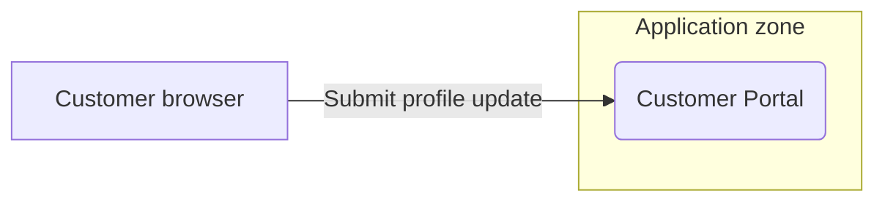
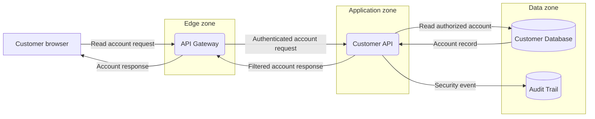
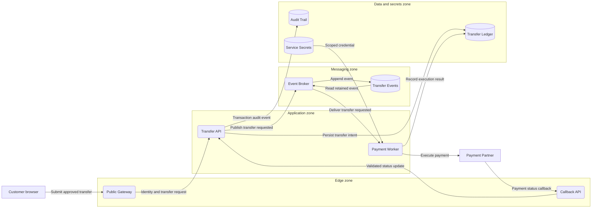
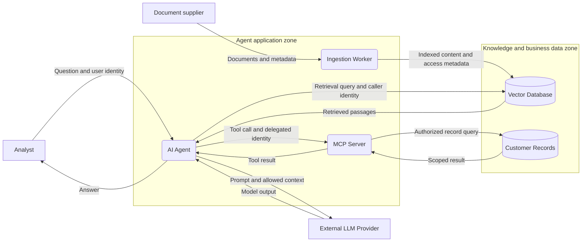

# A practical guide to threat modeling with STRIDE

This guide takes you from a two-node diagram to a multi-service architecture and a reviewed, locally saved report. It is written for pentesters who are new to threat modeling and for experienced reviewers who need a repeatable workflow.

**STRIDE runs locally in your browser.** It draws and analyzes the model you provide; it does not scan a target, call an AI service, upload diagrams, or verify that a control exists. Use the standalone `STRIDE.html` for operation with no network traffic, including startup. See [README.md](README.md) for obtaining/building the offline file and [USAGE.md](USAGE.md) for every control, property, stencil, and rule title.

The systems in the exercises are fictional. Property settings are exercise assumptions, not recommended defaults for every deployment. Carry out any later validation against the environment and accounts authorized for your engagement.

## Learning path

| Stage | What you build or do | What you should learn |
| --- | --- | --- |
| 1 | Prepare scope and identify assets | Turn an engagement brief into modeling questions. |
| 2 | Draw one browser-to-web-app interaction | Use nodes, flows, boundaries, properties, and generated threats. |
| 3 | Review, save, reopen, and export | Separate threats, evidence, decisions, and reports. |
| 4 | Expand to a three-tier customer portal | Model separate protocol legs, data storage, and business authorization. |
| 5 | Build a multi-service banking architecture | Handle identity, queues, third parties, operations, and several views. |
| 6 | Examine WebSockets and AI/MCP | Adapt the workflow to less conventional trust transitions. |
| 7 | Turn the model into a test/review plan | Produce traceable findings, retests, and handoffs. |

Beginners should follow the first exercise without trying to model the whole organization. Experienced reviewers can start with [the complex architecture](#exercise-3-a-multi-service-banking-architecture), then use the review and handoff sections as a checklist.

## Contents

- [1. Understand what you are modeling](#1-understand-what-you-are-modeling)
- [2. Prepare the engagement](#2-prepare-the-engagement)
- [3. Draw trust boundaries correctly](#3-draw-trust-boundaries-correctly)
- [Exercise 1: one browser and one web application](#exercise-1-one-browser-and-one-web-application)
- [Review, save, reopen, and export](#review-save-reopen-and-export)
- [Exercise 2: a three-tier customer portal](#exercise-2-a-three-tier-customer-portal)
- [Exercise 3: a multi-service banking architecture](#exercise-3-a-multi-service-banking-architecture)
- [Exercise 4: cookie-authenticated WebSockets](#exercise-4-cookie-authenticated-websockets)
- [Exercise 5: an AI agent with MCP tools and retrieval](#exercise-5-an-ai-agent-with-mcp-tools-and-retrieval)
- [From threats to a pentest plan](#from-threats-to-a-pentest-plan)
- [Reviewing changes and collaborating through files](#reviewing-changes-and-collaborating-through-files)
- [Migrating an existing Microsoft model](#migrating-an-existing-microsoft-model)
- [Common mistakes and how to correct them](#common-mistakes-and-how-to-correct-them)
- [Completion checklist](#completion-checklist)
- [Glossary](#glossary)

## 1. Understand what you are modeling

A data-flow diagram, or **DFD**, shows who sends data, which code handles it, where it is stored, and where trust changes. It is not simply a network topology or deployment inventory. A box labeled “AWS” or “Production” does not explain which component can authorize a transfer or read a secret.

Start with these building blocks:

| DFD concept | Question | Example |
| --- | --- | --- |
| External entity | Who or what interacts with the system from outside its control? | Customer browser, payment partner, administrator. |
| Process | What executes logic or transforms data? | Transfer API, worker, identity service. |
| Data store | Where does data remain after a request finishes? | Account database, queue, audit log, vault. |
| Data flow | What data moves, in which direction, and using what mechanism? | “Create transfer: amount, payee, session cookie.” |
| Trust boundary | Where does identity, authority, ownership, or security context change? | Browser to service; application to management plane. |
| Threat | What could violate a security objective? | Another customer's account identifier is accepted. |
| Mitigation | What prevents or limits that scenario? | Server-side ownership checks on each account action. |
| Evidence | What supports the model or decision? | Configuration reference, code review, test result, audit event. |

Choose the model's perspective deliberately. A third-party identity provider is normally an **External Entity** if you assess only its integration. If you also assess its implementation, model its internal components as **Processes** and **Data Stores** in the appropriate view.

Likewise, use **Browser** as an external entity when treating the client as an untrusted participant. Use **Browser Client (SPA)** as a process when modeling client-side execution, storage, and interactions. Changing that choice can change applicable rules. Record the perspective; do not add extra representations merely to increase coverage counts.

### Read STRIDE as six questions

| Category | Ask this about the diagram | Example pentest question |
| --- | --- | --- |
| Spoofing | Can a caller or destination pretend to be another identity? | Does the service validate token issuer and audience? |
| Tampering | Can an attacker change data or instructions? | Can a client change an amount or event field after authorization? |
| Repudiation | Can an actor deny an action? | Can a transfer be traced to its actor and outcome without logging secrets? |
| Information Disclosure | Can data reach an unauthorized party? | Can a different tenant retrieve an export? |
| Denial of Service | Can an actor interrupt availability? | Can one tenant monopolize expensive work or queue capacity? |
| Elevation of Privilege | Can an actor do more than their role permits? | Can a normal customer invoke an administrative operation? |

A generated title is a hypothesis to assess. A confirmed vulnerability requires supporting evidence from the actual implementation. Several threats can share one root cause, and a business-logic vulnerability can exist even when no built-in rule names it.

## 2. Prepare the engagement

Before drawing, write a short scope statement. Use **Menu → Model properties…** to preserve it with the model.

```text
Title: Customer transfers — staging architecture review
Owner: Payments engineering
Reviewer: Application security
Contributors: API, platform, identity, and operations representatives
Description: Customer login, payee selection, transfer submission, processing, and audit.
Assumptions: Staging reflects production trust boundaries; data and accounts are synthetic.
External dependencies: Corporate IdP, payment partner, managed database, event platform.
```

Add environment and revision details to the description or assumptions. The application has no dedicated approval, due-date, evidence-upload, or revision-signature fields; use notes and external reference IDs for those needs.

### Gather enough facts to avoid drawing guesses as controls

1. **Assets:** What must remain confidential, correct, attributable, and available? Include customer records, money movement, credentials, signing keys, administrative access, and audit evidence.
2. **Actors:** Which users, services, operators, suppliers, and attacker positions matter? Include a malicious authenticated user and a compromised internal service, not only an anonymous internet actor.
3. **Entry points:** Web/API routes, file uploads, callbacks, queue consumers, jobs, management interfaces, build pipelines, and recovery paths.
4. **Data:** Classifications, identifiers, credentials, ownership, retention, transformations, and exports.
5. **Trust changes:** Different owners, tenants, accounts, networks, machines, runtime privileges, identities, or execution contexts.
6. **Control evidence:** Authentication, authorization, parsing, output handling, encryption, rate limits, audit, backups, and privilege restrictions.
7. **Uncertainty:** Record what is unknown and who can answer it. Leave the relevant property **Not Selected** until supported.

Useful input sources include architecture discussions, API contracts, configuration excerpts, deployment manifests, identity-policy descriptions, and observed request paths. Store references and sanitized observations in the model; avoid copying live credentials or unnecessary customer data into it.

Create a small flow inventory before drawing:

| Flow | Source → target | Data | Mechanism | Trust change | Evidence / question |
| --- | --- | --- | --- | --- | --- |
| Submit transfer | Browser → Transfer API | Payee, amount, account ID, session | HTTPS + cookie | Untrusted client → server | Who verifies ownership and binds approval to these values? |
| Persist transfer | API → Ledger DB | Validated transaction record | Database protocol | App identity → data identity | Which tables/actions can this account access? |
| Payment callback | Partner → Callback API | Partner reference, status | HTTPS + signed message | Supplier → application | How are authenticity and replay checked? |

Model business actions and meaningful data paths. Avoid one anonymous “HTTPS” arrow for an entire product.

## 3. Draw trust boundaries correctly

### Boundary boxes

Press **B**, drag a box around the nodes in a zone, then rename it and select a suitable **Type**. Leave space around node centers so membership is unambiguous. Place callers outside that zone when they do not share its trust.

For a box, the engine compares **source and target node centers**. One inside and one outside means a crossing. Both inside or both outside means no crossing of that box, even if the drawn arrow temporarily passes across its outline.

Practical check: draw a boundary around a web application with the browser outside. Connect browser → application. If you later expand the box to include the browser, that particular crossing disappears and boundary-dependent findings can change.

Moving a box carries enclosed elements with it. Hold **Alt** while moving the boundary alone. Resizing is useful when correcting membership, but inspect the resulting threat changes.

### Boundary lines

Press **L**, draw a separating line, and use its bend handle when needed. This form uses intersection between the boundary curve and the flow curve. It is useful when a box makes a crowded diagram difficult to read, but crossings depend on line placement. An arrow drawn around the end of the line may no longer cross it.

### Choose boundaries for a reason

| Candidate boundary | Why it can matter |
| --- | --- |
| Internet → application | An untrusted caller controls request contents. |
| Edge → private application | TLS may terminate; caller identity may be forwarded or transformed. |
| Application → data zone | A separate identity and policy govern access to stored data. |
| Tenant → shared service | Resource ownership and tenant context must be enforced. |
| Workload → cloud control plane | Service credentials may grant infrastructure powers. |
| Operator → management plane | Privileged actions need stronger authorization and accountability. |
| Build environment → production | Artifact provenance and deployment authority change. |
| Host → container or sandbox | Execution isolation and privileges change. |
| Organization → supplier | You depend on another party's identity and data handling. |

Nested boxes are allowed. For example, a data zone may sit inside a corporate zone. Name them clearly and assess each transition. The application records crossings; it does not infer firewall rules, tenant isolation, a complete hierarchy, or trust inherited from a parent box.

Draw a boundary because trust changes, not around every icon for decoration. **Internet facing**, **Trust level**, and a label such as “Private” do not replace the geometry. A private network also does not prove a workload is trustworthy.

## Exercise 1: one browser and one web application

**Objective:** draw a minimal model, see why a rule fires, correct a control assumption, and record a review. Start a new model after saving any existing work.

The diagrams in this guide are schematic references. Reproduce them on the STRIDE canvas; Mermaid text is not an application import format. Subgraph boxes below represent intended zones, whose geometry you must draw in the app.



### Step 1 — Place and name the nodes

1. Choose **External Entity** with **E** and place it on the left.
2. Name it **Customer browser** and set **Type = Browser** in the properties panel.
3. Set **Trust level = Untrusted**. For this exercise the browser will present a session, so set **Authenticates itself = Yes**. This does not make its input trustworthy.
4. Choose **Process** with **P** and place it on the right.
5. Name it **Customer Portal**, set **Type = Web Application**, and **Internet facing = Yes**.
6. Leave its input validation, authorization, and logging properties **Not Selected** for now. That means you have not established these controls.

### Step 2 — Add the boundary and request

1. Draw a **Trust Boundary** box around Customer Portal only. Name it **Application zone** and choose **Type = Internet Boundary**.
2. Draw a flow from Customer browser to Customer Portal with **A**, or drag from a connection point.
3. Name the flow **Submit profile update** and verify the endpoint names in its panel.
4. For this deliberately weak starting model, choose the following values:

| Flow property | Exercise value | Reason |
| --- | --- | --- |
| Type | HTTP | Start with an unencrypted request to make the consequence visible. |
| Encrypted in transit | No | Confirm the subtype preset. |
| Authentication | Cookie / Session | The browser automatically presents a session cookie. |
| Integrity protected | No | No protected transport or message integrity is recorded. |
| Replay protection | Not Selected | Requires investigation. |
| Rate limited | Not Selected | Requires investigation. |
| Carries credentials / tokens | Yes | The session cookie authenticates the request. |
| Carries sensitive data | Yes | The update contains customer information. |

5. Add a **Note** with **T**: “Exercise baseline: authentication exists; validation, authorization, CSRF protection, and audit evidence are unverified.”
6. Open validation messages. Resolve any unconnected flow or missing boundary before relying on results.

### Step 3 — Inspect the generated threats

Open **Analysis**, clear filters, and select the flow or Customer Portal. The complete count depends on the whole model. Use the rule ID in each detail header to inspect these specific expectations:

| Rule | Expected observation | Why |
| --- | --- | --- |
| P01 | Present for Submit profile update | HTTP with encryption not set to Yes matches the cleartext-protocol rule. |
| I01 and T02 | Hidden on this interaction | P01 supersedes these general transport findings on the same flow. Their absence does not mean cleartext is safe. |
| T01 | Present for Customer Portal | A process receives input without Validates input = Yes. |
| E04 | Present for Customer Portal | An external entity sends a Cookie / Session flow to a Web Application. |
| R01 | Present for Customer Portal | The flow crosses a boundary and Logs security events is not Yes. |
| S01 | Present for Customer browser | An external source is a potential impersonation point. |

T01 can appear on both the target's count and a contributing flow's count while remaining one finding in the register. Select the external entity and use **View** to see source-focused findings such as S01. If “shown” is lower than the properties count, clear status, severity, and category filters; View clears old text search but retains those filters.

### Step 4 — Model a protected transport

Change the request **Type** to **HTTPS**, then explicitly set **Encrypted in transit = Yes** and **Integrity protected = Yes** for this exercise. Check both fields: changing a subtype preserves explicit previous settings, including No.

An untouched P01 finding should stop appearing. If you edited its notes or review, it may remain as an orphan with its history. Check the orphan indication instead of assuming the old transport condition still matches.

E04 remains applicable to review. HTTPS protects transport but does not itself stop a browser from sending an authenticated state-changing request initiated by another site. STRIDE has no dedicated “CSRF protection verified” property. Record relevant controls and evidence in the threat review; do not change Authentication to a false value just to remove E04.

### Step 5 — Understand cookie versus bearer-token modeling

For a separate API architecture that actually uses an explicit bearer token, choose **Token (OAuth / JWT)** on its flow. E04 does not fire for that setting. This is an engine distinction, not a claim that every token-based application is immune to cross-origin or session design mistakes.

Keep **Cookie / Session** for the portal exercise. If the real system supports both mechanisms, model separate paths or document the distinction rather than selecting the more convenient value.

### Step 6 — Verify one control before declaring it

Suppose a reviewer obtains evidence of schema validation for every profile-update field. Add an evidence reference to Customer Portal's Notes, then set **Validates input = Yes** only if that statement accurately covers the process's modeled inputs.

If only this one handler is validated and other handlers are not, setting a process-wide Yes overstates coverage. Split the component at a useful responsibility boundary or retain the uncertain setting and explain per-path results in the grouped finding. The goal is an accurate model, not the lowest count.

**Checkpoint:** You can explain the endpoints, data, authentication, boundary, and reason for each of the listed findings. Save `portal-01-baseline.stride` before expanding the model.

## Review, save, reopen, and export

### Write a useful threat review

Open E04 and use a structure like this fictional record. A proposed fix belongs in mitigation text, but it does not justify Mitigated until there is evidence it works.

| Field | Example |
| --- | --- |
| Owner | Customer Portal team |
| Severity | Medium, based on the profile changes available through this path |
| Notes | “STG-CSRF-04: profile update rejects absent/incorrect anti-forgery values. Cross-origin state-change checks reviewed with two synthetic accounts. Evidence: assessment/evidence/CSRF-04. Reviewed against release r17.” |
| Mitigation description | “Server validates a session-bound anti-forgery value and permitted origins for state-changing requests; session cookie settings reviewed.” |
| Justification | “Reviewed scope covers the profile-update path shown here. Reassess when new state-changing routes are added.” |
| Status | Mitigated only after the stated evidence has actually been obtained. Otherwise Open. |

**Use suggestion** copies generic mitigation guidance into the field. Adapt it to the real design. It neither implements the control nor changes the review status.

Use the statuses consistently:

- **Open:** unanswered, unverified, vulnerable, or pending work.
- **Mitigated:** implemented controls have adequate evidence for the stated scenario and paths.
- **Accepted:** the accountable risk owner explicitly accepts the residual risk. Record the decision reference, scope, and review date/expiry in text; the app does not enforce an approval or expiry workflow.
- **Not Applicable:** the threat's preconditions do not apply, with a concrete explanation. “No exploit found yet” is not the same as non-applicability.

Use severity as a reasoned High/Medium/Low assessment of impact and feasibility in context. The built-in priority is a starting point, not a computed risk score or CVSS result. Keep the rationale in the record when you change it.

### Save and prove recovery

1. Use **Ctrl/Cmd+S** and keep the downloaded `.stride` file with your engagement materials.
2. Check the bottom-right autosave status. If it reports a failure or recovery-copy-only state, save another local file before leaving.
3. Refresh and confirm the model is restored in the same browser/storage location.
4. Use **Ctrl/Cmd+O** to open the saved `.stride` file explicitly. This proves the portable checkpoint works independently of autosave.
5. Check metadata, diagram names, endpoint connections, properties, and the E04 review's status, owner, notes, and mitigation.

Opening files replaces the current model. Save any newer work before this exercise. Autosave stores a current working copy; it is not a catalog of all previously opened models. Keep one active editing tab to avoid tabs replacing each other's recovery copy.

### Produce the first report

1. Open **Analysis → Summary** and compare the remaining open findings with your decisions.
2. Use **Menu → Export report as PDF**. Review the diagram, elements table, category/interaction grouping, and complete threat text.
3. Export **Markdown** if your review workflow needs editable report text. Its diagram is embedded as SVG data; some Markdown viewers hide such images.
4. Export **report JSON** when you need structured report data and a lossless embedded model. It can be reopened with Open.
5. Keep the `.stride` file as the working artifact. A PDF or PNG cannot restore editable threats and review records.

Reports include all diagrams and visible findings, regardless of the current list filters. A grouped finding needing review counts Open in the report. For characters unsupported by direct PDF's bundled fonts, use **Printable HTML report → Print → Save as PDF** with suitable system fonts.

With the standalone file, you can perform this whole exercise disconnected. If your engagement requires explicit verification, open browser developer tools, inspect Network while drawing/saving/importing/exporting, and refresh the standalone file; STRIDE should need no HTTP(S) requests. The hosted application instead requires its initial static asset loads. This check concerns the tool, not the network traffic of the system being modeled.

## Exercise 2: a three-tier customer portal

**Objective:** separate browser, server, data, and audit responsibilities, then identify risks that generic rules cannot decide for you.

Start a new checkpoint or model. Keep earlier exercises in separate files if you want a summary that covers only this architecture. If you add them as extra diagrams to one model, their threats also contribute to totals and reports.



### Step 1 — Build the inventory

| Name | Kind / Type | Responsibility |
| --- | --- | --- |
| Customer browser | External Entity / Browser | Supplies requests and receives customer data. |
| API Gateway | Process / API Gateway | Terminates public traffic and forwards authenticated context. |
| Customer API | Process / Web API / Service | Enforces business authorization and handles data access. |
| Customer Database | Data Store / SQL Database | Stores account/customer records. |
| Audit Trail | Data Store / Audit Trail | Stores attributable security events. |

Draw three boundary boxes for Edge, Application, and Data zones. Keep the browser outside all three. A flow between different boxes crosses their boundaries. This exercise uses distinct zones to expose trust transitions; use the actual identity/policy boundaries for a real deployment.

### Step 2 — Draw each leg separately

Create the seven flows shown above. Name the data or operation, not just the protocol. Choose protocol subtypes for each leg and verify transport settings independently.

| Leg | Useful property decisions | Do not assume |
| --- | --- | --- |
| Browser → gateway | HTTPS; actual Cookie / Session or Token (OAuth / JWT); credential/data flags | TLS proves the user is authorized for the requested account. |
| Gateway → API | Actual HTTPS/gRPC/etc.; encryption; service identity; forwarded user context in notes | Public TLS automatically protects the private leg, or a header cannot be forged. |
| API → database | SQL / DB Protocol; actual authentication; encryption; sensitive-data flag | The protocol subtype automatically enables TLS or least privilege. |
| Database → API | Encryption and sensitive-data flag; returned data/identity semantics in notes | The query request and returned records have identical disclosure consequences. |
| API → audit | Encryption; integrity; authentication; event contents | Having a log store means useful audit events are generated or protected. |
| API → gateway → browser | Data classification, transport, output handling | A safe database query guarantees a safe response or correct record ownership. |

Use notes where a dropdown cannot fully express a mechanism, such as signed forwarded identity or a protocol's response-side identity semantics. Properties should describe that path, not manufacture an authentication exchange that does not exist.

### Step 3 — Set controls at the component that enforces them

- **Customer API:** document authentication of the gateway/workload, authorization of the end user, input validation, output handling, logging, and runtime privilege separately. Set Internet facing according to the defined exposure; document indirect exposure through the gateway even when direct reachability is No.
- **Customer Database:** set Stores PII / sensitive data = Yes for the exercise. Investigate encryption at rest, fine-grained access, credentials, integrity, and backup restoration.
- **Audit Trail:** the subtype presets Stores log data = Yes. Review who can alter/delete events and whether sensitive values are unnecessarily logged.
- **Gateway:** document header stripping/rebuilding, authentication validation, request limits, and what it delegates to the API. Do not mark downstream authorization Yes solely because the gateway checks a token.

T03 can prompt SQL/NoSQL injection review for a database interaction. An element-level X04 finding prompts backup review while Backed up is not Yes. Even where the modeled property removes a generated finding, keep the evidence reference explaining why it was set.

### Step 4 — Add a business-logic threat manually

The generic engine cannot determine your ownership rules. Select Customer API, choose **Analysis → + Add**, and create:

```text
Title: Customer reads another customer's account by changing accountId
Category: Information Disclosure
Description: An authenticated caller can supply another customer's account identifier.
The API must check ownership for the requested account on every read path.
Owner: Customer API team
Severity: High (exercise assumption: detailed financial data is returned)
Status: Open
Mitigation: Bind account access to server-side subject/tenant policy; do not trust client ownership claims.
Notes: Validate with two synthetic customer identities and a known-denied account reference.
```

If a separate write path permits unauthorized transfer creation, add a distinct threat focused on that action and impact. Avoid writing one generic “authorization issue” that cannot be assigned or retested.

### Step 5 — Experience grouped review coverage

1. Give Customer API three inbound flows with distinct names, such as **Read account**, **Update profile**, and **Create payee**. Keep **Validates input = Not Selected** for the exercise.
2. Open T01 for Customer API. It should be one finding with three contributing paths and one description, not three repeated paragraphs. Other targets may have their own T01 findings.
3. In this learning model, add review notes describing evidence for these three paths and set T01 to Mitigated. In an actual engagement, do so only when that evidence exists.
4. Add a fourth inbound flow named **Bulk import** while keeping the target property unchanged.
5. T01 retains its recorded Mitigated decision and notes, displays **New flows since review: Bulk import**, and counts as **Open** in the summary and report.
6. Review the new path. If it meets the same control standard, use **Confirm status for current flows**. If it does not, set Open and record the gap.

Changing an existing flow's data or permissions without changing its ID does not trigger every possible re-review automatically. Treat significant architectural changes as an explicit review task.

**Checkpoint:** Explain where authentication terminates, where object ownership is enforced, where data is exposed, and what evidence would close each open finding. Export a report and confirm that all contributing paths and the manual ownership threat are present.

## Exercise 3: a multi-service banking architecture

**Objective:** model a customer transfer end to end, including asynchronous execution, supplier callbacks, audit, privileged operations, and software delivery.

The example is a fictional design for learning, not a prescribed banking architecture or compliance assessment. Its important security objectives are:

- A customer can initiate only authorized transfers from permitted accounts.
- The approved payee and amount remain bound to the executed transaction.
- Retried requests and events cannot cause unintended duplicate execution.
- A partner response cannot be forged, replayed, or assigned to the wrong transfer.
- Customer data, service credentials, and administrative powers stay within their intended scope.
- Investigators can trace a transaction and operators can recover without silently changing financial state.

### Step 1 — Plan views before adding every component

Use several diagrams when a single canvas would hide the important paths:

| Diagram | Content | Primary questions |
| --- | --- | --- |
| 01 — Transfer execution | Gateway, transfer API, ledger, event platform, worker, partner | Who may move money, with what state, and exactly how often? |
| 02 — Identity and sessions | Browser/client, IdP, callbacks, session/token stores, services | Which identity is authenticated, delegated, and authorized at each step? |
| 03 — Operations and delivery | Admin, bastion, control plane, CI runner, registry, runtime, secrets | Who can change code, credentials, policy, or production state? |

Start with Diagram 01. Add the others when their controls cannot be explained clearly in notes or the main view. Repeated component names in separate diagrams are independent records, so document which view owns the detailed review for each concern. Duplicating a diagram copies the layout but creates new identities and findings; it does not create a shared component or copy completed reviews.

A context diagram is useful for discussion, but including both an abstract and detailed version of the same interactions in the same report can duplicate risk counts. For a clean deliverable, use a separate context-model file or explain the overlapping scope explicitly. Do not mark components out of scope simply to make totals look smaller.

### Step 2 — Place the execution components

| Component | Kind / subtype | Data or authority to record |
| --- | --- | --- |
| Customer browser | External / Browser | User-supplied identifiers and session/token. |
| Public Gateway | Process / API Gateway | Public endpoint and forwarded identity policy. |
| Transfer API | Process / Web API / Service | Customer authorization and transfer approval rules. |
| Transfer Ledger | Store / SQL Database | Transfer intent, approved values, execution state. |
| Event Broker | Process / Kafka Broker | Producer/consumer identities and broker administration. |
| Transfer Events | Store / Kafka Topic / Event Log | Transfer events, retention, consumer visibility. |
| Payment Worker | Process / Background Worker | Execution identity, retry policy, partner access. |
| Payment Partner | External / Payment Gateway | Supplier trust, transaction references, returned status. |
| Callback API | Process / Web API / Service | Partner authenticity, replay protection, state transitions. |
| Audit Trail | Store / Audit Trail | Security events and transaction correlation. |
| Service Secrets | Store / Key Vault / Secret Store | Workload credentials, signing material, rotation scope. |

A Kafka Broker is a process; its persisted topic is a data store. Model both when their administration, authorization, retention, and data risks matter separately. A vault service's API and persisted secrets can likewise be split into process and store views when useful; do not invent extra components without a modeling reason.

### Step 3 — Draw the trust zones

Place Public Gateway and Callback API in an **Edge zone**, Transfer API and Payment Worker in an **Application zone**, Event Broker and Transfer Events in a **Messaging zone**, and ledger/audit/secrets in a **Data and secrets zone**. Keep browser and Payment Partner outside these organization-controlled boxes.

These are exercise boundaries. In a real deployment, separate secrets from ordinary data or split service identities into additional boundaries if their authority differs. A shared subnet need not mean shared trust; an extra subnet alone need not imply a useful security boundary.



This diagram emphasizes the main data paths. Add the credential requests, read results, acknowledgements, and user responses from the inventory below where they affect the assessment. An incoming credential flow does not mean the vault pushes secrets without authentication; model the request and its identity too.

### Step 4 — Build a concrete flow inventory

Use this as a drawing and review checklist. Values in the mechanism column are plausible exercise choices; replace them with evidence from the actual system.

| ID / flow name | Source → target | Mechanism / identity to model | Key question |
| --- | --- | --- | --- |
| F01 Submit transfer | Browser → gateway | HTTPS; actual customer cookie/token | Is the final amount/payee bound to the customer's approval? |
| F02 Forward transfer | Gateway → API | HTTPS with workload identity; delegated subject in notes | Can another caller forge forwarded user/tenant context? |
| F03 Persist intent | API → ledger | SQL / DB Protocol; scoped DB identity and explicit TLS setting | Can the service alter unrelated accounts or audit state? |
| F04 Read intent/result | Ledger → API | Protected DB response; sensitive-data flag | Are returned rows scoped to the approved customer/action? |
| F05 Publish event | API → broker | Kafka Produce / Consume; authenticated producer | Can another workload produce a transfer event? |
| F06 Append event | Broker → topic | Actual broker/storage mechanism | Can persisted messages be changed or retained too broadly? |
| F07 Read retained event | Topic → broker | Actual storage response | What is the consequence of replaying or reordering older data? |
| F08 Subscribe/consume request | Worker → broker | Kafka Produce / Consume; authenticated consumer | Can the worker read unauthorized topics/groups? |
| F09 Deliver event | Broker → worker | Kafka Produce / Consume; authenticated session in notes | Does the worker revalidate data and enforce idempotency? |
| F10 Execute payment | Worker → partner | HTTPS; partner-required credential/signature | Can the request be replayed or sent to an unauthorized destination? |
| F11 Payment response | Partner → worker | HTTPS response; partner identity evidence | Are timeouts or ambiguous responses handled without duplicate execution? |
| F12 Payment callback | Partner → Callback API | Webhook Callback; explicit encryption, authentication, and replay settings | Is authenticity checked over the intended message before state changes? |
| F13 Apply callback | Callback API → Transfer API | Protected authenticated service call | Can an invalid transition or another transfer reference be accepted? |
| F14 Record result | Worker → ledger | Scoped DB identity and protected transport | Is execution state updated consistently with external outcomes? |
| F15 Write audit | API/worker/callback → audit | Separate arrows per producer; authenticated protected logging | Are actor, intent, approval, execution, and result correlated? |
| F16 Request credential | Worker → secrets | HTTPS or actual vault protocol; workload identity | Can this identity request only its own short-lived secrets? |
| F17 Return credential | Secrets → worker | Protected response; Carries credentials / tokens = Yes | Where can the credential be logged, cached, or leaked? |
| F18 Return transfer status | API → gateway → browser | Two separately modeled protected legs | Does the response expose only authorized status and data? |

A data-flow arrow describes the direction of data, which may differ from who opened a connection. For a broker-delivered message or database response, explain the authenticated session in notes rather than pretending that every arrow starts a new login.

For a signed callback, the Authentication dropdown may not exactly describe the signature scheme. Choose only an accurate option, retain uncertainty where necessary, and document signature verification, key selection, timestamp/nonce handling, and replay behavior in notes and manual threats. Selecting API key does not by itself model a cryptographic signature.

### Step 5 — Document properties with evidence

For each process, investigate **Authenticates callers**, **Authorizes requests**, **Validates input**, **Logs security events**, **Running as**, and **Internet facing**. For the worker, include parser behavior and privileges after a forged/malformed message, even though it is not directly public. A background consumer can still receive attacker-influenced data through a valid upstream request or compromised producer.

For stores, record encryption, access scope, sensitive data/secrets, audit integrity, and backup/recovery. The topic subtype's Stores log data preset describes the model's default; assess whether your event payloads also contain personal data or credentials. Do not leave those facts implicit.

For every flow, check encryption on that leg, caller/destination identity, authorization context, data sensitivity, replay behavior, and rate/resource limits. A gateway's public HTTPS setting does not populate or protect the gateway-to-API leg.

Controls often protect different principals. For example, mTLS can authenticate a service while a token identifies the customer. Select the primary mechanism represented by the flow and describe the additional layers in notes; the single dropdown is not a complete identity protocol specification.

### Step 6 — Review each STRIDE category along the transfer

| Category | Questions for this architecture | Evidence/control to seek |
| --- | --- | --- |
| S | Can a workload impersonate the gateway, producer, partner, or operator? | Issuer/audience validation, workload identity policy, callback verification, credential scope. |
| T | Can amount, payee, approval context, event data, or execution state change without permission? | Server-side validation, approval binding, protected transport, signed messages where needed, constrained updates. |
| R | Can the user or service deny approval, submission, or execution? | Correlated attributable events, clock handling, protected audit retention, recorded outcomes. |
| I | Can responses, topics, logs, backups, or error paths reveal other customers' data or secrets? | Object/tenant checks, topic permissions, redaction, key access policy, data minimization. |
| D | Can retries, expensive validation, queue backlog, or partner outages block unrelated users? | Quotas, bounded retries, backpressure, timeouts, isolation, recovery evidence. |
| E | Can a customer become an operator, a consumer become a producer, or a workload become cluster administrator? | Role checks, least privilege, topic/action separation, constrained service accounts, management isolation. |

Follow the data end to end. A locally secure component does not guarantee a secure sequence of state transitions.

### Step 7 — Add threats the model cannot infer

These are examples of manual findings, not guaranteed defects in the fictional system:

| Manual threat | Attach to | Review focus |
| --- | --- | --- |
| Approved payee/amount differs from executed values | Transfer API / Submit transfer | Approval must bind to the exact server-side transaction values. |
| Duplicate event causes duplicate payment | Payment Worker / Deliver event | Idempotency keys, durable deduplication, retries, and crash recovery. |
| Callback changes another customer's transfer | Callback API / Payment callback | Signature/authenticity plus reference ownership and allowed state transition. |
| One tenant exhausts worker capacity | Payment Worker / relevant event flow | Per-tenant fairness and bounded work, not just public request rate limiting. |
| Support user can bypass customer approval | Admin path in operations view | Separation of duties, transaction limits, and independently attributable approval. |
| Restore reintroduces already executed work | Ledger/topic/worker recovery path | Reconciliation and safe replay after restoring different stores. |

Write a scenario, preconditions, affected asset, expected unauthorized outcome, owner, and evidence plan for each. Split unrelated outcomes into separately reviewable records.

### Step 8 — Add identity and operational views

In **02 — Identity and sessions**, model the browser/client, **Identity Provider** process or **OAuth / Social Login Provider** external entity as appropriate, application callback, token/session storage, and service calls. Distinguish authorization redirects, token exchanges, API requests, refresh, logout, and revocation. Record audience, issuer, subject, tenant, scopes, and lifetime assumptions in notes. OAuth 2.0 / OIDC is a flow subtype with a token-authentication preset; it does not prove a correct protocol implementation or set every transport property.

In **03 — Operations and delivery**, consider:

| Component/path | Suggested stencils | What to examine |
| --- | --- | --- |
| Administrator → controlled access path | Administrator; Bastion / Jump Host; Admin Console / Management Plane | MFA, just-in-time access, role boundaries, session audit. |
| Control plane → workloads | Kubernetes Control Plane; Kubernetes Pod; Kubernetes Namespace boundary | Service-account scope, admission/policy changes, secret access, isolation. |
| Source → build → artifact → deployment | Source Code Repository; CI/CD Pipeline; Build Agent / Runner; Container Registry | Untrusted code, runner isolation, signing/provenance, deployment authority. |
| Workload → credentials | Secrets Manager; Key Vault / Secret Store | Credential issue, access, rotation, storage, and revocation. |
| Services → monitoring | SIEM / Log Collector; Audit Trail | Event trust, access, retention, and sensitive content. |

Do not simply draw a Kubernetes box around every service and assume application authorization is covered. If the application subtype is needed for application rules, retain that representation and use properties/notes for its container deployment. Create a dedicated runtime view when pod-level controls require their own elements. Each element has one subtype; a single icon is not a complete inventory of all underlying technologies.

### Step 9 — Finish the architecture review

1. Reconcile the drawing against the flow inventory, including acknowledgements, errors, credentials, callbacks, and management paths.
2. Resolve disconnected flows and unclear names. Distinguish similarly named deployment instances where they have different controls.
3. Review findings per category and per component. Use grouped contributor lists to check that every path was assessed.
4. Challenge each process-wide Yes: does the evidence cover all modeled inputs, callers, or actions?
5. Record manual threats for important business and recovery behaviors.
6. Assign owners and preserve unresolved questions as Open; obtain actual risk decisions for Accepted records.
7. Check **Summary** across all views and inspect retained orphans.
8. Save a `.stride` checkpoint, reopen it, and export PDF plus report JSON for a reviewable handoff.

**Checkpoint:** Another reviewer should be able to trace one transfer, one failed/retried transfer, one partner callback, and one privileged change without needing the diagram author to fill in missing paths verbally.

## Exercise 4: cookie-authenticated WebSockets

**Objective:** distinguish encrypted transport from handshake identity and continuing authorization.

Build **Browser → WebSocket Server / Gateway** across an Internet Boundary. Name the flow **Subscribe to account notifications**, choose **WebSocket Secure (wss://)**, and set **Authentication = Cookie / Session**. Confirm **Encrypted in transit = Yes** and describe the account/channel identifiers supplied by the client.

| Observation | Interpretation |
| --- | --- |
| W01 appears for a supported browser/cookie-authenticated socket path | Review cross-site WebSocket hijacking: permitted origins and handshake/session design matter. TLS alone is insufficient. |
| W02 does not appear for wss | The rule is specifically about generic/plain WebSocket traffic without declared encryption. It does not classify wss as plaintext. |
| W04 appears while the target's Authorizes requests is not Yes | Review authorization for each message/subscription and for a session whose permissions change after connection. |

Repeat the exercise with an actual bearer-token design using **Token (OAuth / JWT)**. W01's cookie-specific condition no longer matches. Review token handling and message authorization anyway; changing an option does not validate the real protocol.

Record test questions such as:

- Does a handshake from an unapproved origin fail under the applicable browser/session behavior?
- Can one account subscribe to another account's channel by changing a channel identifier?
- Are authorization decisions updated when permissions change or a session is revoked?
- Are message size, rate, subscription count, and resource use bounded?
- Are credentials kept out of avoidable URLs, logs, and error messages?

Use separate flow names when command messages and notifications have different data or authority. If testing becomes a larger campaign, split manual threats by outcome rather than combining every WebSocket concern into one record.

## Exercise 5: an AI agent with MCP tools and retrieval

**Objective:** model untrusted instructions/data and the authority exercised by an agent. Using these stencils does not connect STRIDE to an AI provider; they describe the system being assessed.



Use these exact types to reproduce the exercise:

| Component | Kind / Type |
| --- | --- |
| Analyst | External Entity / Human User |
| Document supplier | External Entity / Third-Party Service |
| External LLM Provider | External Entity / LLM Provider API |
| AI Agent | Process / AI Agent / LLM App |
| Ingestion Worker | Process / Background Worker |
| MCP Server | Process / MCP Server |
| Vector Database | Data Store / Vector Database |
| Customer Records | Data Store / SQL Database |

Draw the two zones as boxes, with the analyst, supplier, and provider outside both. Keep the agent, ingestion worker, and MCP server inside the application box and both stores inside the data box. Set the vector store's **Stores PII / sensitive data = Yes** for this exercise. Begin with other security properties **Not Selected** so the expected prompts below are visible, then work through the control experiments.

Draw both the retrieval query and returned passages; they have different rule contexts. Use **MCP (JSON-RPC)** for tool calls/results when that is the actual protocol. Set encryption and authentication from evidence as you refine the model; the subtype alone does not establish a secure transport.

### Identify the trust changes

- User questions, retrieved documents, tool outputs, and model outputs are inputs, even if they look like instructions or system messages.
- A document supplier should not gain the authority to issue financial or administrative tool calls.
- The agent's workload identity and the end user's identity may have different permissions.
- Sending prompts or context to an external provider is a disclosure decision in the modeled system. Draw it explicitly and state which data is allowed.
- Retrieved content and embeddings can carry tenant/ownership constraints that must survive ingestion, lookup, caching, and output.

### Inspect the AI/LLM findings

The 16 A-series rules use the existing six STRIDE categories. The LLM references follow the [OWASP LLM Top 10 (2025)](https://genai.owasp.org/llm-top-10/) numbering. These are architecture-based review prompts, not tests executed against a model or provider.

With the diagram and starting properties above, inspect these specific findings. Generic STRIDE and existing MCP rules can also appear; do not use a fixed overall threat total as the exercise result.

| Rule | Expected matching path or element | What to review |
| --- | --- | --- |
| A01 — Direct prompt injection | One grouped finding on AI Agent, covering the analyst's question and the boundary-crossing retrieved passages. | Input validation does not stop prompt injection. Enforce permissions outside the prompt and constrain tool authority. |
| A02 — Indirect prompt injection | Vector Database → AI Agent; grouped by the agent. | Retrieved content can carry instructions. This rule also accepts direct content from Third-Party Service or SaaS Application sources, even without a boundary crossing. |
| A03 — Unvalidated model output | AI Agent → MCP Server while that receiving process has not declared input validation. | Model output is attacker-influenced when used as tool arguments, shell commands, SQL, or HTML. |
| A04 — System prompt disclosure | AI Agent itself. | Keep secrets and authorization logic out of prompts; system instructions are not a confidentiality boundary. |
| A05 — Per-action authorization | AI Agent while Authorizes requests is not Yes. | Bind every tool action to the actual caller, resource, and allowed operation, with human approval for high-impact actions. |
| A06 — Response disclosure | AI Agent → Analyst. | A response must not reveal data beyond the recipient's entitlement. |
| A07 — Unbounded consumption | One grouped finding on AI Agent for qualifying, non-rate-limited inputs: analyst questions, retrieved passages crossing the data boundary, and external provider output in this layout. | Bound request/token/cost/concurrency budgets and tool execution. Denial-of-wallet is included. |
| A08 — Retrieval entitlements | Vector Database → AI Agent while store Access control is not Fine-grained; grouped by the source store. | Retrieval must filter using the real caller's user/tenant permissions, not an identity supplied in the prompt. |
| A09 — Poisoned indexed content | One grouped finding on Vector Database for inbound flows, including ingestion and the retrieval-query arrow. | Review ingestion provenance and write authority. The rule matches all incoming vector-store flows; document why a genuinely read-only query cannot index content rather than mislabeling its direction. |
| A10 — Embedding inversion | Vector Database with Stores PII / sensitive data = Yes. | Readable vectors may reveal source text. Encryption at rest does not prevent inversion by an authorized reader of decrypted embeddings. |
| A16 — Unverified decision output | AI Agent itself. | Verify facts and calculations; require accountable review before consequential decisions. |

Two intentional exclusions matter: **LLM Provider API → agent** and **MCP Server → agent** do not trigger A01. MCP-origin content is already addressed by **M01**. **Agent → LLM Provider API** does not trigger A06; **M04** covers provider-bound disclosure. These exclusions do not suppress other applicable rules such as A07. The existing M01 condition is broad: it matches every outgoing MCP Server flow, including the record query in this diagram, so assess the specific scenario rather than assuming every match is a tool response.

A01 and A02 can both match retrieved content crossing a boundary: A01 includes boundary-crossing input, and A02 identifies the retrieved-content precondition. They are not supersession rules. T03 still excludes Vector Database; use A08–A10 for vector-specific review, and retain a separate SQL Database component if that technology is actually present.

### Change controls and observe what remains

Perform these experiments in the learning model. In an engagement, change properties only when supported by implementation evidence.

1. Set the agent's **Validates input = Yes**. A01 and A02 remain; ordinary schema validation does not establish prompt-injection resistance.
2. Set the MCP server's **Validates input = Yes**. Its A03 finding stops matching. If the recipient is instead **Browser** or **Browser Client (SPA)**, A03 remains even with a validation property set; inspect safe rendering for the browser context.
3. Set the agent's **Authorizes requests = Yes** after recording tool-side authorization evidence. A05 stops matching. A04 and A16 remain review prompts; there are no corresponding “safe prompt” or “verified decisions” switches.
4. Set vector-store **Access control = Fine-grained**. A08 stops matching. A09 remains because ingestion provenance is a separate question. Setting **Encrypted at rest = Yes** does not suppress A10 while Stores PII / sensitive data remains Yes.
5. Set **Rate limited = Yes** on every qualifying inbound flow to the agent. A07 stops matching only once no remaining flow meets its conditions. Limiting the public question flow alone does not cover the other contributors in this drawing.
6. Review A06 using caller-scoped retrieval, context, conversation isolation, and response evidence. There is no response-entitlement checkbox to suppress it; record the verified mitigation and status.

“Stops matching” describes the current rule result. An edited finding can remain as an orphan, preserving its review, as explained in the earlier exercises. For grouped A01/A02/A07/A08/A09 findings, adding a new matching flow after a non-open decision requires reviewing the new contributor. Use **Confirm status for current flows** only after that review.

### Extend the model to cover A11–A15

The base drawing has no training/model store, model-serving process, or external MCP-client subtype, so A11–A15 do not match it. Add these components and paths for the next exercise:

| Addition | Starting properties | Expected rules and control experiment |
| --- | --- | --- |
| Data Store / ML Model / Training Data, named Model Artefacts | Integrity protected (signed) and Access control = Not Selected | A11 covers poisoning; A12 covers theft. Integrity = Yes suppresses A11; Fine-grained access suppresses A12. |
| Process / ML Model Serving, named Prediction API; Model Artefacts → Prediction API and Model Artefacts → AI Agent | Loading flows' Integrity protected = Not Selected | A13 on each loading interaction. Setting integrity on the store alone does not set it on the loading flows; verify and record both. A13 stops matching on a flow when its Integrity protected is Yes. |
| Analyst → Prediction API | Flow Rate limited and process Authenticates callers = Not Selected | A14 covers extraction/inversion; A07 can also cover consumption. A14 stops matching only when both rate limiting and caller authentication are Yes. A14 is grouped by the serving process. |
| External Entity / MCP Client / AI Assistant → MCP Server | Authentication = None or Not Selected | A15 covers client impersonation. Declare the actual verified authentication, such as Token (OAuth / JWT), to stop that match. M02/M03 still prompt review of tool authority and token handling. |

A13 also recognizes a **Compromised Supply Chain** source and either an AI Agent / LLM App or ML Model Serving destination. Its mitigation calls for signed artefacts, pinned hashes, approved provenance, and safe loading formats. Pickle can execute code during deserialization; formats such as [safetensors](https://huggingface.co/docs/safetensors/index) avoid that form of executable tensor serialization. Format choice does not establish trustworthy weights or safe loader extensions by itself.

### Make the findings specific to the engagement

| Threat scenario | What a meaningful review establishes |
| --- | --- |
| Retrieved content induces an unauthorized tool call | Tool permission and argument checks remain server-enforced regardless of instruction text. |
| Retrieval returns another tenant's records | Access filtering applies to the actual caller and cannot be bypassed by alternate query paths. |
| Agent forwards restricted data to a provider | Data classification, approved destinations, and context selection are enforced. |
| MCP server acts as a confused deputy | Delegated identity and tool scope bind the operation to the requesting user. |
| Tool output changes subsequent authorization decisions | Untrusted output cannot replace authoritative policy or identity. |
| Recursive tool use exhausts cost/capacity | Budgets, timeouts, call limits, and cancellation are enforced at the relevant components. |

Use A01–A16 and M01–M04 as starting points for these scenarios. Refine generated descriptions and add manual findings for distinct outcomes or missing paths, such as a particular unauthorized payment tool or cross-tenant conversation cache. The presence of these rules does not provide a complete evaluation of prompt injection, tenant filtering, or agency limits.

Use synthetic documents and harmless marker actions for authorized tests. Record whether the boundary was enforced, which identity authorized the action, and what reached external systems. Avoid claiming a mitigation based only on a prompt that tells the model to behave.

## From threats to a pentest plan

The model becomes useful when every important hypothesis has a clear verification task and outcome. Work from boundaries and high-value actions, then use categories to check for gaps.

### Turn a finding into a bounded test question

| Part | Example: unauthorized account access |
| --- | --- |
| Model reference | Customer API; Read account; displayed finding number and rule ID if generated. |
| Preconditions | Two synthetic customer identities, each owning one account; approved staging environment. |
| Action to assess | Request an account using an identity that does not own it, including relevant alternate handlers. |
| Expected secure behavior | Access denied without disclosing the record; event attributable to the caller. |
| Evidence | Sanitized request/response references, service decision/log reference, build/version. |
| Impact if violated | Cross-customer disclosure; assess available data and scope. |
| Remediation | Server-side object authorization shared by every affected path. |
| Retest | Repeat the denied case and a permitted control case after the fix. |

For availability, money movement, deletion, and third-party calls, define the allowed test method and environment before execution. A review can use configuration, code, bounded tests, or recovery exercises as appropriate; drawing a path does not authorize disruptive testing.

### Use a repeatable evidence note

Paste a compact structure into the threat's **Notes** field and fill it in with references rather than sensitive raw material:

```text
Scenario / assumption:
Environment and release:
Paths reviewed:
Actor / role / tenant:
Expected control:
Verification method and date:
Observed result:
Evidence reference(s):
Remaining gaps:
Reviewer / decision reference:
Retest or next-review trigger:
```

Record mitigation separately so the reader can distinguish the control from the observation. A design proposal can be complete while the threat remains Open pending implementation. Conversely, a rule may continue to generate a threat because it has no property for a particular control; keep its reviewed decision and evidence rather than falsifying properties.

### Prioritize with context

Consider exposed entry points, accessible identities, required privileges, data sensitivity, blast radius, reversibility, and existing compensating controls. Assess chains such as:

```text
Untrusted callback → invalid state update → privileged worker execution → financial loss
Compromised CI runner → altered artifact → deployed service identity → secret access
Cross-tenant retrieval → sensitive prompt context → external provider disclosure
```

The application does not compute these chains or their risk. Add a manual finding or explanatory note for a material combined scenario, linked by textual references to the component findings. Avoid counting both the chain and each contributing weakness as independent loss events without explanation.

### Review categories beyond the obvious web bugs

Experienced pentesters should deliberately check areas that endpoint-centric testing can miss:

- **Repudiation:** event completeness, attribution through asynchronous work, time/correlation, and resistance to evidence alteration.
- **Availability:** backpressure, worker concurrency, dependency failure, cost limits, and tenant fairness.
- **Recovery:** restore order, replay safety, credential recovery, and stale authorization after rollback.
- **Operations:** support roles, break-glass access, configuration changes, and migration jobs.
- **Supply chain:** untrusted code in builds, privileged runners, artifact integrity, and deployment identity.
- **Data lifecycle:** exports, logs, caches, replicas, backups, retention, and deletion.

For OT, IoT, or contact-center assessments, use the relevant stencils but retain the same questions. A **PLC / Controller** with **Modbus** requires explicit operational trust and authorization assumptions; an **IVR System** with **SIP / RTP (Voice)** and **Call Recording Store** adds caller identity, voice signaling/media, recording access, and retention questions. Specialized icons do not establish domain-specific safety or regulatory completeness.

## Reviewing changes and collaborating through files

### Reassess more than newly generated findings

After an architecture change, examine:

1. New or removed components, flows, boundaries, authentication mechanisms, and data classes.
2. Changes to existing flows whose IDs remain the same; these may not create a new-flow review notice.
3. Grouped findings with new contributors and previous decisions that no longer cover the whole scenario.
4. Orphans retained because a reviewed rule stopped matching. Explain the changed condition or retire the record deliberately.
5. Manual threats whose assumptions or attachments changed.
6. Model-wide totals and duplicates across multiple diagrams.

For grouped findings, the engine retains the previous notes/status while counting a needs-review record Open. Do not clear that flag solely to restore a previous dashboard number. Review every new contributing path and then confirm the status.

Legacy per-flow records merged into a group preserve their notes and mitigations with flow labels. Conflicting statuses adopt a conservative outcome and require review. Their suppressed history remains in JSON for audit; it is not a second set of active findings to assess.

### Use a file-based review process

STRIDE has no shared server, account assignments, live co-editing, or automatic model merge. A simple process is:

1. A model custodian saves `transfers-r03-draft.stride` and distributes it through the team's approved channel.
2. Reviewers keep their own copies and supply finding numbers, diagram/flow names, evidence references, and proposed changes.
3. The custodian reconciles decisions in one authoritative model. Compare IDs as well as names; independently duplicated shapes are not the same record.
4. Save a new checkpoint with a revision note in model metadata.
5. Export the reviewed PDF and report JSON from that exact checkpoint.

Do not rely on autosave to maintain separate versions or edit several copies in concurrent tabs sharing storage. Do not use a share link as an access-controlled repository: anyone with the full link can decode the snapshot. For sensitive or disconnected handoffs, use `.stride` files under the organization's normal document controls.

The PDF is a readable assessment artifact. The `.stride` file or lossless report JSON is the editable source of review decisions. Keep both when the engagement requires later updates or audit reconstruction.

## Migrating an existing Microsoft model

If you already have a Microsoft Threat Modeling Tool `.tm7` file:

1. Save your current STRIDE model before opening another file.
2. Use **Menu → Open…** and select the `.tm7` file locally.
3. Read the validation/import warnings before reviewing the generated architecture.
4. Compare diagram names, geometry, node kinds, subtypes, and flow direction against the source model.
5. Select flagged elements and inspect **Microsoft TMT import**, original type, and source property values.
6. Repair generic/unmapped shapes and unresolved endpoints. An unknown shape may have been retained as a note, which is not an executable process for interaction analysis.
7. Check authentication, encryption, scope, and every control used to justify a review. Ambiguous values should remain unverified.
8. Compare imported threat status, severity, category, and review text. Unknown values can use warned fallback values; inspect them individually.
9. Review overlaps between imported manual findings and native generated findings after editing. Microsoft/custom XML templates are not automatically converted into equivalent STRIDE JSON rules.
10. Record mapping decisions and save a `.stride` checkpoint. Retain the original `.tm7` for comparison.

Original XML is preserved in the imported model for traceability. Warnings describe import-time issues and may remain after repairs; document the resolution. The application does not export `.tm7` or guarantee identical behavior across all Microsoft/custom templates.

## Common mistakes and how to correct them

| Mistake | Why it weakens the assessment | Better approach |
| --- | --- | --- |
| Drawing network boxes without data labels | The attacker-controlled values and business actions are unclear. | Label flows with operation/data, protocol, and identity context. |
| A flow only visually touches a shape | No endpoint identity may be attached, so no interaction threats are generated. | Check source → target names and validation messages. |
| Both endpoints are inside an intended separating box | The engine sees no crossing of that box. | Put endpoint centers on the intended sides or use a correctly intersecting boundary line. |
| Treating “internal” as authenticated/authorized | Compromised workloads and malicious insiders remain relevant. | Model service identities and least privilege at each boundary. |
| Changing HTTPS type but leaving Encrypted = No | Presets preserve explicit old choices. | Recheck all flow properties after subtype changes. |
| Choosing Token authentication to hide a cookie threat | The model stops representing the real system. | Preserve the actual mechanism and record the verified cookie-specific mitigation. |
| Setting every process control to Yes | Unverified properties hide useful review prompts. | Require evidence and state partial coverage explicitly. |
| Closing a group after reviewing only one path | Other inputs may have different controls. | Inspect every contributor; re-review additions. |
| Treating Accepted as implemented mitigation | Acceptance records a risk decision, not a technical fix. | Record accountable approval and residual risk separately. |
| Treating absent threats as proof of safety | Rule coverage depends on types/properties and cannot infer business policy. | Walk each category and add manual scenarios. |
| Counting every badge as a different threat | A group can belong to several elements/flows. | Use Summary and the threat register for model totals. |
| Assuming View clears every filter | Category/status/severity can still narrow the list. | Clear filters when reconciling counts; check context-menu search text too. |
| Assuming a corrected finding was deleted | Edited findings may remain as visible orphans. | Inspect the record and retain or retire it deliberately. |
| Deleting a reviewed diagram as cleanup | Its threat records are deleted as well. | Save a checkpoint first and confirm the retained report scope. |
| Duplicating detailed diagrams without adjusting scope | Independent findings can overstate the number of distinct risks. | Separate architectural views and document overlap. |
| Saving only PNG or PDF | Review fields and editable model identities cannot be restored. | Keep `.stride` or report JSON alongside presentation exports. |
| Assuming local autosave is a backup archive | One browser recovery slot can be replaced or cleared. | Save versioned model files at milestones. |

## Completion checklist

Use this before a review meeting or final handoff. A “No” should become a correction, an explicit assumption, or a tracked open question.

### Architecture quality

- [ ] Scope, environment, owner, reviewer, assumptions, and dependencies are recorded.
- [ ] High-value assets and business actions are identifiable.
- [ ] Nodes use appropriate kinds and subtypes with unambiguous names.
- [ ] Relevant request, response, event, callback, credential, audit, and privileged paths are present.
- [ ] Flows have real endpoints, correct direction, meaningful names, and accurate properties.
- [ ] Trust boundaries represent actual authority changes, with correct geometric crossings.
- [ ] Significant exclusions have reasons, and their effect on flow/rule coverage is understood.
- [ ] Validation and import warnings have been resolved or explained.

### Threat and evidence quality

- [ ] All six STRIDE categories have been considered, including categories with no generated findings.
- [ ] Business logic, tenant separation, supply chain, operations, and recovery have been considered where relevant.
- [ ] Every important finding states a concrete scenario and affected asset.
- [ ] Owners, severities, statuses, notes, and mitigation descriptions reflect the actual review.
- [ ] Mitigated decisions have evidence; Accepted decisions have accountable justification.
- [ ] Not Applicable decisions explain the missing preconditions.
- [ ] Grouped findings cover every current contributor and no review notice has been dismissed without assessment.
- [ ] Significant edits to existing flow IDs have been manually reassessed.
- [ ] Retained orphans and duplicate coverage across diagrams are understood.

### Delivery quality

- [ ] A `.stride` checkpoint opens with diagrams, properties, and review decisions intact.
- [ ] Browser autosave is not the only copy.
- [ ] Model-wide summary totals and open/review-required records are understood.
- [ ] The PDF includes readable diagrams, element tables, and complete grouped threat text.
- [ ] Unicode/font handling and long paragraphs have been visually checked in the chosen report format.
- [ ] Report JSON is available when structured/lossless handoff is required.
- [ ] The delivered files use the intended revision, scope, and information-handling controls.
- [ ] Future review triggers and unresolved questions have clear owners or references.

## Glossary

| Term | Meaning in this workflow |
| --- | --- |
| DFD | Data-flow diagram: nodes, stores, directed data, and trust transitions. |
| Trust boundary | A change in identity, authority, ownership, or security context; represented geometrically for crossing rules. |
| Stencil / subtype | A technology-specific type for an element, which can affect presets and rules. |
| Interaction | One directed, connected flow with source and target context. |
| Rule ID | Stable identifier such as T01 for a template rule. |
| Finding number | Model-local display number such as #18 for a generated or manual threat record. |
| Grouped finding | One rule/endpoint finding listing several contributing flows in a diagram. |
| Review coverage | Flow IDs considered when a grouped finding received a non-open decision. |
| Needs review | Previous decision is preserved, but the finding counts as Open until current coverage is confirmed. |
| Orphan | A retained edited/reviewed finding that no longer matches or whose attachment disappeared. |
| Supersession | A specific matching rule hides a more general finding on the same interaction. |
| Mitigation | An implemented or proposed control; its description alone does not establish effectiveness. |
| Residual risk | Risk that remains after controls, to be addressed or explicitly accepted. |
| `.stride` | Local JSON model file containing editable architecture and review state. |
| Report JSON | Structured report envelope with a complete embedded model for lossless reopening. |

For exact controls and options while working through these exercises, keep the [feature reference](USAGE.md) open alongside the application.
